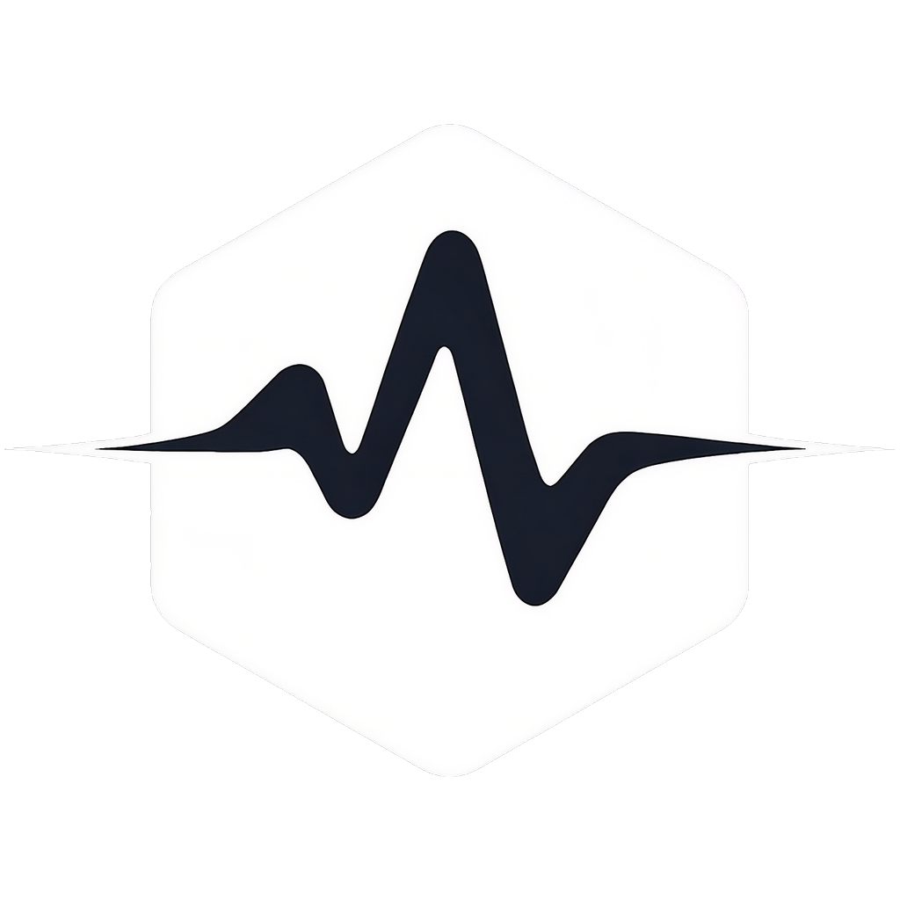

<div align="center">

<picture>
  <source media="(prefers-color-scheme: dark)" srcset="assets/logo-dark.svg" width="120">
  <source media="(prefers-color-scheme: light)" srcset="assets/logo.svg" width="120">
  
</picture>

# SignalFlow

**Real-time-first framework for trading signal research and execution**

<p>
<a href="https://pypi.org/project/signalflow-trading/"></a>
<a href="https://www.python.org/downloads/"></a>
<a href="LICENSE"></a>
<a href="https://github.com/astral-sh/ruff"></a>
</p>

</div>

---

SignalFlow is a Polars-backed framework for algorithmic trading research that
takes a strategy from idea to backtest to live with **one object you can save and
ship**. The public surface is six nouns:

| Noun | What it is |
|------|------------|
| **Dataset** | One lazy, immutable market-data container. `sf.data(...)` builds it; the same object feeds backtest, paper, and live. |
| **Transform** | A column-producing step - features (`SMA` in core; `RSI`, `ATR`, `ZScore`, … via the `signalflow-ta` plugin) and detectors (`SmaCrossDetector`, `ThresholdDetector`) share one contract. |
| **Models** | `ForecastModel` (trainable predictor → probability column) plus validator combinators. |
| **Flow** | The central, deployable, tradeable unit: forecasts → detectors → validator → strategy → risk. |
| **Engine** | The decision/execution loop and brokers (`SimBroker` for backtest/paper, `BinanceBroker` for armed live). |
| **Run** | The result of executing a Flow - equity curve, fills, and a standard `.scorecard()`. |

## Install

```bash
pip install signalflow-trading
```

| Extra | Installs | For |
|-------|----------|-----|
| `signalflow-trading[ta]` | signalflow-ta | 256 technical-indicator features + 30 detectors |
| `signalflow-trading[labs]` | signalflow-labs[rl] | neural encoders, RL strategy, torch backends |
| `signalflow-trading[live]` | mlflow, huggingface_hub | model artifact tracking / deploy |
| `signalflow-trading[llm]` | httpx, pydantic | LLM-assisted strategy (any OpenAI-compatible server) |
| `signalflow-trading[all]` | ta + labs + live + llm | everything |
| `signalflow-trading[dev]` | pytest, ruff, mypy | development |

## Idea → first backtest

```python
import signalflow as sf

ds = sf.data("memory", pairs=["BTCUSDT"], start="2023-01-01", interval="1h")

model = sf.ForecastModel(target=sf.FixedHorizon(bars=12),
                         features=sf.FeaturePipe(sf.SMA(10), sf.SMA(20), sf.SMA(50)))
model.fit(ds)                                          # train tier-1 forecaster

flow = sf.Flow(name="sma_rise",
               forecasts={"rise": model},
               detectors=[sf.ThresholdDetector(forecast="rise", p_min=0.6)],
               strategy=sf.RulesStrategy())
run = flow.backtest(ds, capital=50_000)
print(run.scorecard())                                 # total_return, sharpe, max_drawdown, ...
```

## Backtest → paper → live

One decision core drives all three modes. Backtest and paper replay a finished
Dataset; live consumes a streaming feed (`PollingFeed` polls Binance for each
closed bar) and routes orders to a real venue when `armed=True`.

```python
flow.paper(ds, capital=50_000)                         # sim fills over a Dataset

feed = sf.PollingFeed(sf.BinanceSource(), pairs=["BTCUSDT"], interval="1m")
flow.live(feed, capital=50_000)                         # live data, SimBroker (paper)
flow.live(feed, capital=50_000, armed=True,             # real orders on Binance
          broker=sf.BinanceBroker(api_key=..., api_secret=...),
          state_path="book.json")                       # book persists across restarts
```

## CLI

```bash
sf list                 # registry snapshot grouped by type
sf list transform       # one type, with one-line summaries
sf run flow.yaml --source memory --pairs BTCUSDT --start 2023-01-01 --interval 1h --capital 50000
sf promote flow.yaml --to shadow   # validate + show the registry op (real promotion: sf-prod)
sf version
```

## Three invariants worth knowing

**WoE/IV encoding is the default.** Features flow through Weight-of-Evidence
encoding against the target, and `IVSelector` keeps only columns whose Information
Value clears a threshold. Encoding is monotone, leak-aware, and fit out-of-fold.

**A Flow is inference-only.** Every forecast slot (and the optional validator
slot) must hold a *trained* model. Constructing a `Flow` around an unfitted model
raises `UntrainedModelError` - you cannot accidentally deploy something untrained.
The same Flow object runs `backtest` and `paper` over a Dataset and `live` over a
streaming feed - one decision core, no separate execution path to drift.

**Deploy is data.** `flow.save(path)` serializes the whole stack (config +
trained artifacts) to YAML plus a model directory; `sf.Flow.load(path)` brings it
back byte-for-byte. There is no code to redeploy - promoting a strategy is moving
a file. Model artifacts can live on the local filesystem, MLflow, or the Hugging
Face Hub (`model.save("mlflow://...")`, `model.save("hf://...")`).

```python
flow.save("flows/rsi_rise.yaml")
same = sf.Flow.load("flows/rsi_rise.yaml")
assert same.backtest(ds, capital=50_000).final_equity == run.final_equity
```

## Registry

Every core class registers under a name - that name is what `flow.yaml`
serializes and `sf list` enumerates. Seven `ComponentType`s: SOURCE, TRANSFORM,
MODEL, STRATEGY, SAMPLER, BROKER, METRIC.

```python
sf.registry.snapshot()                          # {type: [names]}
sf.registry.list(sf.ComponentType.TRANSFORM)    # core: ['sma', 'woe', ...]; +256 with [ta]
```

Installing a plugin (`signalflow-ta`, `signalflow-labs`) auto-registers its
components via entry points - no imports or wiring needed.

## Ecosystem

| Package | Description |
|---------|-------------|
| **signalflow-ta** | Technical-indicator plugin: 256 features + 30 detectors (`[ta]` extra) |
| **signalflow-labs** | Neural encoders, RL strategy, torch backends (`[labs]` extra) |
| **sf-prod** | Promotion, shadow/live rollout, monitoring |

---

**License:** MIT &ensp;·&ensp; **Author:** [pathway2nothing](https://github.com/pathway2nothing) &ensp;·&ensp; **Docs:** [signalflow-trading.com](https://signalflow-trading.com)
