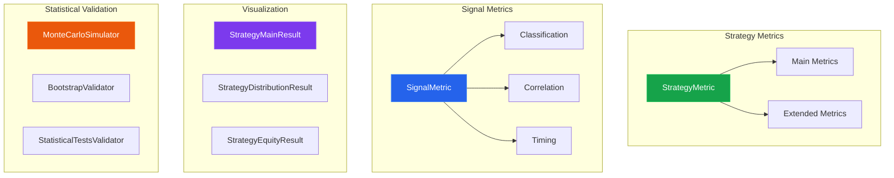

# Analytic Module

The analytic module provides metrics for evaluating trading strategies and signals, along with statistical validation tools.

---

## Architecture



---

## Strategy Metrics

Strategy metrics compute performance indicators during backtesting. All metrics inherit from `StrategyMetric` and are registered via `@sf_component`.

### Base Class

::: signalflow.analytic.base.StrategyMetric
    options:
      show_root_heading: true
      show_source: true

### Main Metrics

Core performance metrics computed during backtest execution.

#### TotalReturnMetric

::: signalflow.analytic.strategy.main_strategy_metrics.TotalReturnMetric
    options:
      show_root_heading: true
      show_source: true

#### DrawdownMetric

::: signalflow.analytic.strategy.main_strategy_metrics.DrawdownMetric
    options:
      show_root_heading: true
      show_source: true

#### WinRateMetric

::: signalflow.analytic.strategy.main_strategy_metrics.WinRateMetric
    options:
      show_root_heading: true
      show_source: true

#### SharpeRatioMetric

::: signalflow.analytic.strategy.main_strategy_metrics.SharpeRatioMetric
    options:
      show_root_heading: true
      show_source: true

#### BalanceAllocationMetric

::: signalflow.analytic.strategy.main_strategy_metrics.BalanceAllocationMetric
    options:
      show_root_heading: true
      show_source: true

### Extended Metrics

Advanced performance metrics for deeper analysis.

#### SortinoRatioMetric

Risk-adjusted return using only downside volatility.

::: signalflow.analytic.strategy.extended_metrics.SortinoRatioMetric
    options:
      show_root_heading: true
      show_source: true

**Parameters:**

| Parameter | Type | Default | Description |
|-----------|------|---------|-------------|
| `window_size` | int | 100 | Rolling window for returns history |
| `risk_free_rate` | float | 0.0 | Risk-free rate for ratio calculation |
| `target_return` | float | 0.0 | Target return threshold for downside |

**Output:** `{"sortino_ratio": float}`

#### CalmarRatioMetric

Return relative to maximum drawdown.

::: signalflow.analytic.strategy.extended_metrics.CalmarRatioMetric
    options:
      show_root_heading: true
      show_source: true

**Output:** `{"calmar_ratio": float, "annualized_return": float, "max_drawdown_calmar": float}`

#### ProfitFactorMetric

Gross profit divided by gross loss.

::: signalflow.analytic.strategy.extended_metrics.ProfitFactorMetric
    options:
      show_root_heading: true
      show_source: true

**Output:** `{"profit_factor": float, "gross_profit": float, "gross_loss": float}`

#### AverageTradeMetric

Average profit, loss, and trade duration statistics.

::: signalflow.analytic.strategy.extended_metrics.AverageTradeMetric
    options:
      show_root_heading: true
      show_source: true

**Output:**

| Key | Description |
|-----|-------------|
| `avg_profit` | Mean profit from winning trades |
| `avg_loss` | Mean loss from losing trades |
| `avg_trade` | Mean PnL across all trades |
| `avg_duration_minutes` | Mean trade duration |
| `avg_win_duration` | Mean duration of winning trades |
| `avg_loss_duration` | Mean duration of losing trades |

#### ExpectancyMetric

Mathematical expectancy of profit per trade.

::: signalflow.analytic.strategy.extended_metrics.ExpectancyMetric
    options:
      show_root_heading: true
      show_source: true

**Formula:** `expectancy = win_rate * avg_win - loss_rate * avg_loss`

**Output:** `{"expectancy": float, "expectancy_ratio": float}`

#### RiskRewardMetric

Risk/reward ratio (average win / average loss).

::: signalflow.analytic.strategy.extended_metrics.RiskRewardMetric
    options:
      show_root_heading: true
      show_source: true

**Output:** `{"risk_reward_ratio": float, "payoff_ratio": float}`

#### MaxConsecutiveMetric

Tracks consecutive winning and losing streaks.

::: signalflow.analytic.strategy.extended_metrics.MaxConsecutiveMetric
    options:
      show_root_heading: true
      show_source: true

**Output:**

| Key | Description |
|-----|-------------|
| `max_consecutive_wins` | Maximum winning streak |
| `max_consecutive_losses` | Maximum losing streak |
| `current_win_streak` | Current winning streak |
| `current_loss_streak` | Current losing streak |

### Usage Example

```python
from signalflow.analytic.strategy import (
    SortinoRatioMetric,
    CalmarRatioMetric,
    ProfitFactorMetric,
    ExpectancyMetric,
)
from signalflow.strategy.runner import BacktestRunner

# Create runner with extended metrics
runner = BacktestRunner(
    strategy_id="my_strategy",
    broker=broker,
    entry_rules=[entry_rule],
    exit_rules=[exit_rule],
    metrics=[
        SortinoRatioMetric(window_size=100, risk_free_rate=0.02),
        CalmarRatioMetric(),
        ProfitFactorMetric(),
        ExpectancyMetric(),
    ],
)

state = runner.run(raw_data, signals)

# Access metric values
print(f"Sortino: {state.metrics.get('sortino_ratio', 0):.2f}")
print(f"Calmar: {state.metrics.get('calmar_ratio', 0):.2f}")
print(f"Profit Factor: {state.metrics.get('profit_factor', 0):.2f}")
print(f"Expectancy: ${state.metrics.get('expectancy', 0):.2f}")
```

---

## Signal Metrics

Signal metrics analyze the quality and effectiveness of trading signals.

### Base Class

::: signalflow.analytic.base.SignalMetric
    options:
      show_root_heading: true
      show_source: true

### SignalClassificationMetric

::: signalflow.analytic.signals.classification_metrics.SignalClassificationMetric
    options:
      show_root_heading: true
      show_source: true

### SignalProfileMetric

::: signalflow.analytic.signals.profile_metrics.SignalProfileMetric
    options:
      show_root_heading: true
      show_source: true

### SignalDistributionMetric

::: signalflow.analytic.signals.distribution_metrics.SignalDistributionMetric
    options:
      show_root_heading: true
      show_source: true

### SignalCorrelationMetric

Analyzes correlation between signal strength and actual returns.

::: signalflow.analytic.signals.correlation_metrics.SignalCorrelationMetric
    options:
      show_root_heading: true
      show_source: true

**Parameters:**

| Parameter | Type | Default | Description |
|-----------|------|---------|-------------|
| `look_ahead_periods` | list[int] | [15, 30, 60, 120] | Minutes to look ahead for return calculation |
| `min_samples` | int | 30 | Minimum samples for correlation calculation |

**Output:**

| Key | Description |
|-----|-------------|
| `correlations` | Pearson/Spearman correlations by period |
| `quintile_analysis` | Performance by signal strength quintile |
| `total_signals` | Number of signals analyzed |

**Visualization:** Scatter plots of signal strength vs. returns, quintile performance bars.

### SignalTimingMetric

Analyzes optimal hold time after signal entry.

::: signalflow.analytic.signals.correlation_metrics.SignalTimingMetric
    options:
      show_root_heading: true
      show_source: true

**Parameters:**

| Parameter | Type | Default | Description |
|-----------|------|---------|-------------|
| `max_look_ahead` | int | 240 | Maximum minutes to analyze |
| `sample_points` | int | 24 | Number of time points to sample |

**Output:**

| Key | Description |
|-----|-------------|
| `optimal_hold_time_mean` | Time with highest mean return |
| `optimal_hold_time_sharpe` | Time with highest Sharpe ratio |
| `peak_mean_return` | Maximum mean return achieved |
| `series` | Time series data for plotting |

**Visualization:** Line charts showing mean return, Sharpe ratio, and win rate over time.

### Signal Metrics Usage

```python
from signalflow.analytic.signals import (
    SignalCorrelationMetric,
    SignalTimingMetric,
    SignalClassificationMetric,
)

# Create metrics
correlation = SignalCorrelationMetric(
    look_ahead_periods=[15, 30, 60],
    min_samples=50,
)
timing = SignalTimingMetric(
    max_look_ahead=120,
    sample_points=12,
)

# Compute metrics
corr_result, corr_ctx = correlation.compute(raw_data, signals)
timing_result, timing_ctx = timing.compute(raw_data, signals)

# Generate visualizations
fig_corr = correlation.plot(corr_result, corr_ctx, raw_data, signals)
fig_timing = timing.plot(timing_result, timing_ctx, raw_data, signals)

# Access quantitative results
print(f"30min correlation: {corr_result['quant']['correlations']['period_30']['pearson_corr']:.3f}")
print(f"Optimal hold time: {timing_result['quant']['optimal_hold_time_mean']} minutes")
```

---

## Result Visualization

Classes for visualizing backtest results.

### StrategyMainResult

Main dashboard with equity curve, trades, and key metrics.

::: signalflow.analytic.strategy.result_metrics.StrategyMainResult
    options:
      show_root_heading: true
      show_source: true

### StrategyPairResult

Per-pair performance breakdown.

::: signalflow.analytic.strategy.result_metrics.StrategyPairResult
    options:
      show_root_heading: true
      show_source: true

### StrategyDistributionResult

Returns distribution analysis with histogram and QQ plot.

::: signalflow.analytic.strategy.result_metrics.StrategyDistributionResult
    options:
      show_root_heading: true
      show_source: true

**Features:**

- Returns histogram with normal distribution overlay
- QQ plot for normality assessment
- Monthly returns heatmap (Year × Month)
- Distribution statistics (skew, kurtosis)

### StrategyEquityResult

Equity curve with optional benchmark comparison.

::: signalflow.analytic.strategy.result_metrics.StrategyEquityResult
    options:
      show_root_heading: true
      show_source: true

**Features:**

- Strategy equity curve
- Optional benchmark overlay
- Drawdown highlighting
- Performance statistics panel

### Visualization Usage

```python
from signalflow.analytic.strategy import (
    StrategyMainResult,
    StrategyDistributionResult,
    StrategyEquityResult,
)

# After running backtest
state = runner.run(raw_data, signals)

# Main dashboard
main_viz = StrategyMainResult()
fig_main = main_viz.plot(state, raw_data)
fig_main.show()

# Distribution analysis
dist_viz = StrategyDistributionResult()
fig_dist = dist_viz.plot(state, raw_data)
fig_dist.show()

# Equity with benchmark
equity_viz = StrategyEquityResult(benchmark_col="close")
fig_equity = equity_viz.plot(state, raw_data)
fig_equity.show()
```

---

## Statistical Validation

Tools for validating strategy robustness.

### MonteCarloSimulator

::: signalflow.analytic.stats.MonteCarloSimulator
    options:
      show_root_heading: true
      show_source: true

### BootstrapValidator

::: signalflow.analytic.stats.BootstrapValidator
    options:
      show_root_heading: true
      show_source: true

### StatisticalTestsValidator

::: signalflow.analytic.stats.StatisticalTestsValidator
    options:
      show_root_heading: true
      show_source: true

### Convenience Functions

```python
from signalflow.analytic import (
    monte_carlo,
    bootstrap,
    statistical_tests,
    plot_monte_carlo,
    plot_bootstrap,
    plot_validation_summary,
)

# Monte Carlo simulation
mc_result = monte_carlo(returns, n_simulations=1000)
fig_mc = plot_monte_carlo(mc_result)

# Bootstrap analysis
bs_result = bootstrap(returns, n_bootstrap=1000)
fig_bs = plot_bootstrap(bs_result)

# Statistical tests
test_result = statistical_tests(returns)
fig_summary = plot_validation_summary(test_result)
```

---

## Metrics Summary Table

### Strategy Metrics

| Metric | Output Keys | Description |
|--------|-------------|-------------|
| `TotalReturnMetric` | `final_return` | Total portfolio return |
| `DrawdownMetric` | `max_drawdown`, `current_drawdown` | Drawdown tracking |
| `WinRateMetric` | `win_rate`, `total_trades` | Win percentage |
| `SharpeRatioMetric` | `sharpe_ratio` | Risk-adjusted return |
| `SortinoRatioMetric` | `sortino_ratio` | Downside-adjusted return |
| `CalmarRatioMetric` | `calmar_ratio`, `annualized_return` | Return / max drawdown |
| `ProfitFactorMetric` | `profit_factor`, `gross_profit`, `gross_loss` | Profit vs loss ratio |
| `AverageTradeMetric` | `avg_profit`, `avg_loss`, `avg_trade`, `avg_duration_minutes` | Trade statistics |
| `ExpectancyMetric` | `expectancy`, `expectancy_ratio` | Expected profit per trade |
| `RiskRewardMetric` | `risk_reward_ratio`, `payoff_ratio` | Avg win / avg loss |
| `MaxConsecutiveMetric` | `max_consecutive_wins`, `max_consecutive_losses` | Streak tracking |

### Signal Metrics

| Metric | Key Features |
|--------|--------------|
| `SignalClassificationMetric` | Precision, recall, F1-score |
| `SignalProfileMetric` | Signal distribution by type, pair |
| `SignalDistributionMetric` | Probability distribution analysis |
| `SignalCorrelationMetric` | Strength vs. returns correlation |
| `SignalTimingMetric` | Optimal hold time analysis |

---

## See Also

- **[Strategy Module](strategy.md)**: Backtest execution and entry/exit rules
- **[Core API](core.md)**: `StrategyState`, `Portfolio`, `Position`
- **[Visualization](viz.md)**: Pipeline visualization tools
