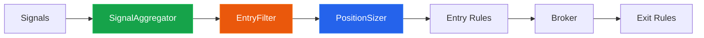
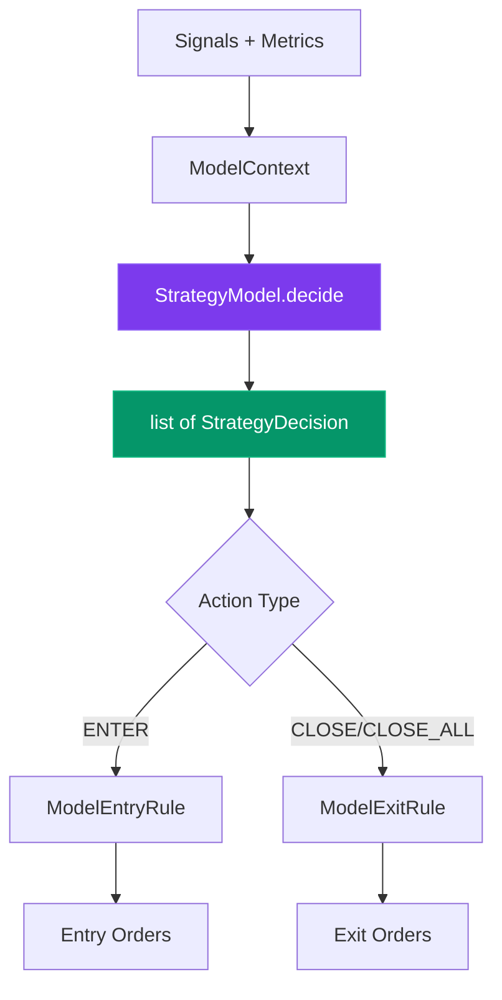

# Strategy Module

The strategy module provides components for backtesting and live trading execution.

---

## Architecture



---

## Execution

::: signalflow.strategy.runner.backtest_runner.BacktestRunner
    options:
      show_root_heading: true
      show_source: true

---

## Entry Rules

::: signalflow.strategy.component.entry.signal.SignalEntryRule
    options:
      show_root_heading: true
      show_source: true

::: signalflow.strategy.component.entry.fixed_size.FixedSizeEntryRule
    options:
      show_root_heading: true
      show_source: true

---

## Exit Rules

::: signalflow.strategy.component.exit.tp_sl.TakeProfitStopLossExit
    options:
      show_root_heading: true
      show_source: true

---

## Position Sizing

Position sizers compute the notional value (in quote currency) for trades based on signal strength, portfolio state, and market conditions.

### Base Classes

::: signalflow.strategy.component.sizing.base.SignalContext
    options:
      show_root_heading: true
      show_source: true

::: signalflow.strategy.component.sizing.base.PositionSizer
    options:
      show_root_heading: true
      show_source: true

### Available Sizers

#### FixedFractionSizer

Allocate a fixed percentage of equity per trade.

::: signalflow.strategy.component.sizing.fixed_fraction.FixedFractionSizer
    options:
      show_root_heading: true
      show_source: true

#### SignalStrengthSizer

Scale position size by signal probability.

::: signalflow.strategy.component.sizing.signal_strength.SignalStrengthSizer
    options:
      show_root_heading: true
      show_source: true

#### KellyCriterionSizer

Optimal sizing using the Kelly Criterion formula.

::: signalflow.strategy.component.sizing.kelly.KellyCriterionSizer
    options:
      show_root_heading: true
      show_source: true

#### VolatilityTargetSizer

Size positions to achieve target volatility contribution.

::: signalflow.strategy.component.sizing.volatility_target.VolatilityTargetSizer
    options:
      show_root_heading: true
      show_source: true

#### RiskParitySizer

Equal risk contribution across positions.

::: signalflow.strategy.component.sizing.risk_parity.RiskParitySizer
    options:
      show_root_heading: true
      show_source: true

#### MartingaleSizer

Grid/DCA strategy with increasing position sizes.

::: signalflow.strategy.component.sizing.martingale.MartingaleSizer
    options:
      show_root_heading: true
      show_source: true

### Usage Example

```python
from signalflow.strategy.component.sizing import (
    FixedFractionSizer,
    KellyCriterionSizer,
    VolatilityTargetSizer,
    SignalContext,
)
from signalflow.core import StrategyState

# Create test state
state = StrategyState(strategy_id="demo")
state.portfolio.cash = 10_000.0
prices = {"BTCUSDT": 50000.0}

# Signal context
signal = SignalContext(
    pair="BTCUSDT",
    signal_type="rise",
    probability=0.75,
    price=50000.0,
)

# Fixed 2% of equity per trade
sizer = FixedFractionSizer(fraction=0.02)
notional = sizer.compute_size(signal, state, prices)  # $200

# Half-Kelly sizing
kelly = KellyCriterionSizer(kelly_fraction=0.5, default_win_rate=0.55)
notional = kelly.compute_size(signal, state, prices)

# Volatility targeting (requires ATR in state.runtime)
state.runtime["atr"] = {"BTCUSDT": 1000.0}  # 2% ATR
vol_sizer = VolatilityTargetSizer(target_volatility=0.01)
notional = vol_sizer.compute_size(signal, state, prices)
```

---

## Entry Filters

Entry filters provide pre-trade validation to improve signal quality.
All filters return `(allowed: bool, reason: str)` tuples.

### Base Classes

::: signalflow.strategy.component.entry.filters.EntryFilter
    options:
      show_root_heading: true
      show_source: true

::: signalflow.strategy.component.entry.filters.CompositeEntryFilter
    options:
      show_root_heading: true
      show_source: true

### Available Filters

#### RegimeFilter

Only enter when market regime matches signal direction.

::: signalflow.strategy.component.entry.filters.RegimeFilter
    options:
      show_root_heading: true
      show_source: true

#### VolatilityFilter

Skip entries in extreme volatility conditions.

::: signalflow.strategy.component.entry.filters.VolatilityFilter
    options:
      show_root_heading: true
      show_source: true

#### DrawdownFilter

Pause trading after significant drawdown.

::: signalflow.strategy.component.entry.filters.DrawdownFilter
    options:
      show_root_heading: true
      show_source: true

#### CorrelationFilter

Avoid concentrated positions in correlated assets.

::: signalflow.strategy.component.entry.filters.CorrelationFilter
    options:
      show_root_heading: true
      show_source: true

#### TimeOfDayFilter

Restrict trading to specific hours.

::: signalflow.strategy.component.entry.filters.TimeOfDayFilter
    options:
      show_root_heading: true
      show_source: true

#### PriceDistanceFilter

Filter entries based on price distance from existing positions.

::: signalflow.strategy.component.entry.filters.PriceDistanceFilter
    options:
      show_root_heading: true
      show_source: true

#### SignalAccuracyFilter

Pause trading when signal accuracy drops below threshold.

::: signalflow.strategy.component.entry.filters.SignalAccuracyFilter
    options:
      show_root_heading: true
      show_source: true

### Usage Example

```python
from signalflow.strategy.component.entry import (
    CompositeEntryFilter,
    DrawdownFilter,
    RegimeFilter,
    VolatilityFilter,
    TimeOfDayFilter,
)

# Combine multiple filters (AND logic)
composite = CompositeEntryFilter(
    filters=[
        DrawdownFilter(max_drawdown=0.10, recovery_threshold=0.05),
        RegimeFilter(),
        VolatilityFilter(max_volatility=0.03),
        TimeOfDayFilter(blocked_hours=[0, 1, 2, 3]),  # Skip overnight
    ],
    require_all=True,  # All must pass
)

allowed, reason = composite.allow_entry(signal, state, prices)
if not allowed:
    print(f"Entry rejected: {reason}")
```

---

## Signal Aggregation

Combine signals from multiple detectors using voting or weighting logic.

### VotingMode

::: signalflow.strategy.component.entry.aggregation.VotingMode
    options:
      show_root_heading: true

| Mode | Description |
|------|-------------|
| `MAJORITY` | Most common signal type wins (requires min_agreement) |
| `WEIGHTED` | Weighted average of probabilities |
| `UNANIMOUS` | All detectors must agree |
| `ANY` | Any non-NONE signal passes (highest probability wins) |
| `META_LABELING` | Detector direction × validator probability |

### SignalAggregator

::: signalflow.strategy.component.entry.aggregation.SignalAggregator
    options:
      show_root_heading: true
      show_source: true

### Usage Examples

```python
from signalflow.strategy.component.entry import SignalAggregator, VotingMode

# Majority voting: signal needs >50% agreement
aggregator = SignalAggregator(
    voting_mode=VotingMode.MAJORITY,
    min_agreement=0.5,
)
combined = aggregator.aggregate([signals_1, signals_2, signals_3])

# Weighted voting with custom weights
aggregator = SignalAggregator(
    voting_mode=VotingMode.WEIGHTED,
    weights=[2.0, 1.0, 1.0],  # First detector weighted 2x
    probability_threshold=0.6,
)
combined = aggregator.aggregate([primary_signals, secondary_1, secondary_2])

# Meta-labeling: detector direction × validator confidence
aggregator = SignalAggregator(
    voting_mode=VotingMode.META_LABELING,
    probability_threshold=0.5,
)
combined = aggregator.aggregate([detector_signals, validator_signals])
# Combined probability = detector_prob * validator_prob

# Unanimous: all must agree for high-conviction trades
aggregator = SignalAggregator(
    voting_mode=VotingMode.UNANIMOUS,
    probability_threshold=0.7,
)
combined = aggregator.aggregate([detector_1, detector_2, detector_3])
```

---

## Integration with SignalEntryRule

Position sizers and entry filters can be injected into `SignalEntryRule`:

```python
from signalflow.strategy.runner import BacktestRunner
from signalflow.strategy.component.entry import (
    SignalEntryRule,
    CompositeEntryFilter,
    DrawdownFilter,
    RegimeFilter,
)
from signalflow.strategy.component.sizing import KellyCriterionSizer
from signalflow.strategy.component.exit import TakeProfitStopLossExit
from signalflow.strategy.broker import BacktestBroker
from signalflow.strategy.broker.executor import VirtualSpotExecutor

# Create advanced entry rule
entry_rule = SignalEntryRule(
    position_sizer=KellyCriterionSizer(kelly_fraction=0.5),
    entry_filters=CompositeEntryFilter(
        filters=[
            DrawdownFilter(max_drawdown=0.10),
            RegimeFilter(),
        ],
    ),
)

# Run backtest
runner = BacktestRunner(
    strategy_id="advanced_strategy",
    broker=BacktestBroker(executor=VirtualSpotExecutor(fee_rate=0.001)),
    entry_rules=[entry_rule],
    exit_rules=[TakeProfitStopLossExit(take_profit_pct=0.02, stop_loss_pct=0.01)],
    initial_capital=10_000.0,
)

state = runner.run(raw_data=raw_data, signals=signals)
```

---

## Grid Trading Example

Combine `MartingaleSizer` with `PriceDistanceFilter` for grid strategies:

```python
from signalflow.strategy.component.entry import (
    SignalEntryRule,
    PriceDistanceFilter,
)
from signalflow.strategy.component.sizing import MartingaleSizer

# Grid strategy: buy more as price drops
entry_rule = SignalEntryRule(
    position_sizer=MartingaleSizer(
        base_size=100.0,      # Start with $100
        multiplier=1.5,       # Increase 50% per level
        max_grid_levels=5,    # Max 5 levels
    ),
    entry_filters=PriceDistanceFilter(
        min_distance_pct=0.02,  # 2% price drop between levels
        direction_aware=True,
    ),
    max_positions_per_pair=5,
)
```

---

## Data Sources

Components access data through `StrategyState`:

| Component | Data Source | Key |
|-----------|-------------|-----|
| `VolatilityTargetSizer` | ATR values | `state.runtime["atr"]` |
| `RiskParitySizer` | ATR values | `state.runtime["atr"]` |
| `DrawdownFilter` | Current drawdown | `state.metrics["current_drawdown"]` |
| `VolatilityFilter` | ATR values | `state.runtime["atr"]` |
| `RegimeFilter` | Market regime | `state.runtime["regime"]` |
| `CorrelationFilter` | Correlation matrix | `state.runtime["correlations"]` |
| `SignalAccuracyFilter` | Accuracy metrics | `state.runtime["signal_accuracy"]` |

Populate these during backtest:

```python
# Example: populate runtime data before entry rule
def on_bar_hook(state, timestamp, prices):
    state.runtime["atr"] = calculate_atr(prices)
    state.runtime["regime"] = detect_regime(prices)
```

---

## Full Backtest Example

Complete example using signal aggregation, entry filters, and position sizing:

```python
from datetime import datetime
from pathlib import Path

import polars as pl
from signalflow.data.raw_store import DuckDbRawStore
from signalflow.data.source import VirtualDataProvider
from signalflow.data import RawDataFactory
from signalflow.detector import ExampleSmaCrossDetector
from signalflow.strategy.broker import BacktestBroker
from signalflow.strategy.broker.executor import VirtualSpotExecutor
from signalflow.strategy.runner import BacktestRunner
from signalflow.strategy.component.entry import (
    SignalEntryRule,
    SignalAggregator,
    VotingMode,
    CompositeEntryFilter,
    DrawdownFilter,
    TimeOfDayFilter,
)
from signalflow.strategy.component.sizing import VolatilityTargetSizer
from signalflow.strategy.component.exit import TakeProfitStopLossExit

# 1. Generate synthetic data
PAIRS = ["BTCUSDT", "ETHUSDT"]
START = datetime(2025, 1, 1)

spot_store = DuckDbRawStore(db_path=Path("backtest.duckdb"), timeframe="1m")
provider = VirtualDataProvider(store=spot_store, seed=42)
provider.download(pairs=PAIRS, n_bars=5000, start=START)

# 2. Load data
raw_data = RawDataFactory.from_duckdb_spot_store(
    spot_store_path=Path("backtest.duckdb"),
    pairs=PAIRS,
    start=START,
    end=datetime(2025, 1, 4),
)

# 3. Create multiple detectors
detector_fast = ExampleSmaCrossDetector(fast_period=10, slow_period=30)
detector_slow = ExampleSmaCrossDetector(fast_period=20, slow_period=50)

signals_fast = detector_fast.run(raw_data.view())
signals_slow = detector_slow.run(raw_data.view())

# 4. Aggregate signals (unanimous agreement)
aggregator = SignalAggregator(
    voting_mode=VotingMode.UNANIMOUS,
    probability_threshold=0.0,
)
signals = aggregator.aggregate([signals_fast, signals_slow])

# 5. Configure entry rule with sizer and filters
entry_rule = SignalEntryRule(
    position_sizer=VolatilityTargetSizer(
        target_volatility=0.015,
        default_volatility_pct=0.02,
        max_fraction=0.15,
    ),
    entry_filters=CompositeEntryFilter(
        filters=[
            DrawdownFilter(max_drawdown=0.10),
            TimeOfDayFilter(allowed_hours=list(range(6, 22))),
        ],
    ),
    max_positions_per_pair=1,
    max_total_positions=5,
)

# 6. Run backtest
runner = BacktestRunner(
    strategy_id="advanced_strategy",
    broker=BacktestBroker(executor=VirtualSpotExecutor(fee_rate=0.001)),
    entry_rules=[entry_rule],
    exit_rules=[TakeProfitStopLossExit(take_profit_pct=0.02, stop_loss_pct=0.015)],
    initial_capital=10_000.0,
)

state = runner.run(raw_data, signals)
results = runner.get_results()

print(f"Total Return: {results.get('final_return', 0) * 100:.2f}%")
print(f"Max Drawdown: {results.get('max_drawdown', 0) * 100:.2f}%")
print(f"Win Rate: {results.get('win_rate', 0) * 100:.1f}%")

# Cleanup
spot_store.close()
```

---

## External Model Integration

SignalFlow supports integration with external ML/RL models via a Protocol-based interface. Models make trading decisions (entry, exit, hold) based on signals and metrics.

### Architecture



**Design Principle**: Strategy models see signals and metrics only, NOT raw OHLCV prices.

### StrategyAction

::: signalflow.strategy.model.decision.StrategyAction
    options:
      show_root_heading: true

| Action | Description |
|--------|-------------|
| `ENTER` | Open new position (uses `size_multiplier`) |
| `SKIP` | Skip this signal |
| `CLOSE` | Close specific position (requires `position_id`) |
| `CLOSE_ALL` | Close all positions for a pair |
| `HOLD` | Do nothing |

### StrategyDecision

::: signalflow.strategy.model.decision.StrategyDecision
    options:
      show_root_heading: true
      show_source: true

### ModelContext

::: signalflow.strategy.model.context.ModelContext
    options:
      show_root_heading: true
      show_source: true

### StrategyModel Protocol

::: signalflow.strategy.model.protocol.StrategyModel
    options:
      show_root_heading: true
      show_source: true

### ModelEntryRule

::: signalflow.strategy.model.rules.ModelEntryRule
    options:
      show_root_heading: true
      show_source: true

### ModelExitRule

::: signalflow.strategy.model.rules.ModelExitRule
    options:
      show_root_heading: true
      show_source: true

### Model Integration Example

```python
from signalflow.strategy.model import (
    StrategyModel,
    StrategyAction,
    StrategyDecision,
    ModelContext,
    ModelEntryRule,
    ModelExitRule,
)
from signalflow.strategy.runner import BacktestRunner
from signalflow.strategy.broker import BacktestBroker
from signalflow.strategy.broker.executor import VirtualSpotExecutor
from signalflow.strategy.component.exit import TakeProfitStopLossExit


# 1. Implement the StrategyModel protocol
class MyRLModel:
    """Example RL model for trading decisions."""

    def __init__(self, model_path: str):
        # Load your trained model
        self.model = self._load_model(model_path)

    def decide(self, context: ModelContext) -> list[StrategyDecision]:
        decisions = []

        # Risk management: skip during high drawdown
        if context.metrics.get("max_drawdown", 0) > 0.15:
            return decisions

        # Process each signal
        for row in context.signals.value.iter_rows(named=True):
            pair = row["pair"]
            prob = row.get("probability", 0.5)

            # Get model prediction
            features = self._build_features(row, context.metrics)
            action, confidence = self.model.predict(features)

            if action == "enter" and confidence > 0.6:
                decisions.append(StrategyDecision(
                    action=StrategyAction.ENTER,
                    pair=pair,
                    size_multiplier=min(confidence, 1.5),
                    confidence=confidence,
                    meta={"model": "rl_v1"},
                ))

        # Check if should close any positions
        for pos in context.positions:
            if self._should_close(pos, context):
                decisions.append(StrategyDecision(
                    action=StrategyAction.CLOSE,
                    pair=pos.pair,
                    position_id=pos.id,
                    confidence=0.9,
                    meta={"reason": "model_exit"},
                ))

        return decisions


# 2. Create rules with the model
model = MyRLModel("model.pt")

entry_rule = ModelEntryRule(
    model=model,
    base_position_size=0.02,  # 2% base size
    max_positions=5,
    min_confidence=0.6,
)

exit_rule = ModelExitRule(
    model=model,
    min_confidence=0.7,  # Higher threshold for exits
)

# 3. Run backtest
runner = BacktestRunner(
    strategy_id="model_strategy",
    broker=BacktestBroker(executor=VirtualSpotExecutor(fee_rate=0.001)),
    entry_rules=[entry_rule],
    exit_rules=[
        exit_rule,
        TakeProfitStopLossExit(take_profit_pct=0.03, stop_loss_pct=0.02),
    ],
    initial_capital=10_000.0,
)

state = runner.run(raw_data, signals)
```

---

## Data Export

Export backtest results for external ML model training.

### BacktestExporter

::: signalflow.strategy.exporter.parquet_exporter.BacktestExporter
    options:
      show_root_heading: true
      show_source: true

### Export Format

**bars.parquet** - Per-bar signals and metrics:

| Column | Description |
|--------|-------------|
| `timestamp` | Bar timestamp |
| `pair` | Trading pair |
| `signal_type` | Signal type (e.g. `rise`, `fall`, `local_max`) |
| `probability` | Signal probability |
| `metric_equity` | Portfolio equity |
| `metric_max_drawdown` | Max drawdown |
| `open_position_count` | Open positions count |

**trades.parquet** - Completed trades:

| Column | Description |
|--------|-------------|
| `position_id` | Position ID |
| `pair` | Trading pair |
| `entry_time`, `exit_time` | Trade timestamps |
| `entry_price`, `exit_price` | Prices |
| `realized_pnl` | Realized profit/loss |
| `exit_reason` | Why trade closed |
| `model_confidence` | Model confidence at entry |

### Export Example

```python
from pathlib import Path
from signalflow.strategy.exporter import BacktestExporter

# Create exporter
exporter = BacktestExporter()

# Option 1: Manual export during custom backtest loop
for ts in timestamps:
    # ... process bar ...
    exporter.export_bar(ts, signals, state.metrics, state)

# Export when positions close
for closed_position in newly_closed:
    exporter.export_position_close(
        position=closed_position,
        exit_time=ts,
        exit_price=prices[closed_position.pair],
        exit_reason="take_profit",
    )

# Write to disk
exporter.finalize(Path("./training_data"))

# Option 2: Load for training
import polars as pl

bars_df = pl.read_parquet("./training_data/bars.parquet")
trades_df = pl.read_parquet("./training_data/trades.parquet")

# Prepare features for ML training
features = bars_df.select([
    "timestamp", "pair", "signal_type", "probability",
    "metric_equity", "metric_max_drawdown",
])
```

---

## See Also

- **[Model Integration Guide](../guide/model-integration.md)**: Detailed ML/RL integration tutorial
- **[Quick Start](../quickstart.md)**: Basic strategy setup
- **[Core API](core.md)**: `StrategyState`, `Portfolio`, `Position`
