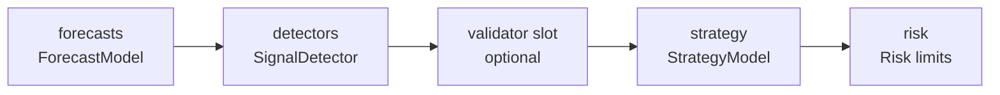

# Concepts

SignalFlow is built around one deployable object - the `Flow` - and three
invariants that make a backtest trustworthy enough to promote unchanged. This page
explains the tier stack, why each tier is shaped the way it is, and where the
invariants are enforced in code.

---

## The tier stack

A `Flow` is a fixed pipeline of five tiers:



- **Forecasts** - one or more trained `ForecastModel`s. This is the only tier that
  *learns*: it maps features to a probability column, out-of-fold.
- **Detectors** - non-learned rules that turn a forecast (or raw columns) into a
  discrete signal, e.g. `ThresholdDetector(forecast="rise", p_min=0.6)`.
- **Validator slot** - an optional second-opinion model that can veto or reweight
  signals before they reach the strategy.
- **Strategy** - turns validated signals into intents (pair, side, size).
  `RulesStrategy` is the built-in rule engine.
- **Risk** - hard limits (`max_drawdown`, `max_positions`, `max_notional_per_pair`)
  plus an optional kill-switch file.

### Why detectors are deliberately simple

The learning lives in the forecast tier, not the detector. A detector is a thin,
inspectable rule - a threshold, a crossover - with no fitted state. That split keeps
the decision rule reproducible and auditable: you can read exactly why a signal fired,
and the only thing that needs careful leak-free training is the forecast underneath
it. It also means a detector serializes to a few parameters in `flow.yaml`.

---

## Invariant 1: leak-free out-of-sample by mechanism

A `ForecastModel` never scores itself on data it trained on. `fit` builds embargoed
walk-forward folds and stitches their out-of-fold predictions into `oos_`. The two
prediction methods are different on purpose:

```python
import signalflow as sf

ds = sf.data("memory", pairs=["BTCUSDT"], start="2023-01-01", interval="1h")
model = sf.ForecastModel(target=sf.FixedHorizon(bars=12),
                         features=sf.FeaturePipe(sf.SMA(10), sf.SMA(20)))
model.fit(ds)

in_sample = model.predict(ds)         # production prediction over any rows
oos = model.predict_oos(ds)           # null outside the trained OOS span
print("oos nulls outside span:", oos.get_column(model.output).null_count())
```

- `predict` is the production path - use it live, never feed it back into training.
- `predict_oos` returns values **only inside the cached OOS span**; everything else is
  null (or, with `strict=True`, a `FingerprintMismatch`).

Enforcement: `ForecastModel.fit` / `predict_oos` (`model/forecast.py`), the
`LeakageError` guard in `Sampler._require_oos` (`sampler/base.py`), and the `oos=True`
path in `enriched_signals` (`flow/loop.py`) which routes every forecast and the
validator through `predict_oos` so detectors cannot fire on in-sample rows. A
`Provenance` stamp records which span produced each output.

---

## Invariant 2: backtest == simulate

`flow.backtest` precomputes signals over a finished Dataset (vectorized, fast).
`flow.simulate` replays the **identical decision core used live**, feeding bars one at
a time and recomputing over only the data seen so far. If the flow is causal, the two
agree exactly:

```python
flow = sf.Flow(name="sma_rise",
               forecasts={"rise": model},
               detectors=[sf.ThresholdDetector(forecast="rise", p_min=0.6)],
               strategy=sf.RulesStrategy())

bt = flow.backtest(ds, capital=10_000)
sim = flow.simulate(ds, capital=10_000)     # incremental; the live decision core
assert sim.final_equity == bt.final_equity
assert len(sim.fills) == len(bt.fills)
```

What it proves: any look-ahead that leaked into a feature or detector breaks the
equality, so `simulate` is the test that a flow which backtests well will trade the
same way live. It is slower (it recomputes per bar), so use it to validate a flow, not
for routine research. Enforcement lives in the shared loop: `run_event_loop`
(`flow/loop.py`) versus `run_live_loop` (`flow/live.py`).

---

## Invariant 3: deploy is data

`flow.save(path, model_dir=...)` serializes the whole stack - declarative component
configs plus trained model artifacts - to a YAML file and a model directory.
`sf.Flow.load(path)` restores a byte-identical backtest:

```python
flow.save("flows/sma_rise.yaml", model_dir="flows/models")
same = sf.Flow.load("flows/sma_rise.yaml")
assert same.backtest(ds, capital=10_000).final_equity == bt.final_equity
```

There is no code to redeploy - promoting a strategy is moving a file. The YAML holds
the wiring (each component's `to_config`) and pinned model URIs; the model directory
holds the cloudpickled model, the OOS parquet, and fingerprints. Enforcement:
`flow/yaml.py` (`save_flow` / `load_flow`) and `model/store/_layout.py`.

---

## Warmup semantics

Features need a leading window of history before their output is stable. A Flow
derives that window from its components:

```python
print(flow.required_warmup)                 # max over detector + feature-pipe warmups
sim = flow.simulate(ds, capital=10_000, warmup=flow.required_warmup)
```

`simulate(warmup=N)` reserves a leading lookback window that fills buffers without
trading - a train/test boundary for walk-forward. `warmup=None` resolves to
`required_warmup`; an explicit `0` is honored. Fixing the warmup makes backtest and
live cold-start cut the identical slice, so the parity in Invariant 2 holds from the
first bar. Enforcement: `Flow.required_warmup` and `Flow.simulate` (`flow/flow.py`).

---

## Where a Flow refuses to run

A Flow is inference-only: every forecast and validator slot must hold a **trained**
model, or construction raises `UntrainedModelError`. A detector that references a
missing forecast slot, or a wrong target type, raises `FlowConfigError`. You cannot
accidentally assemble - let alone deploy - an untrained or mis-wired stack
(`Flow._check_fitted` / `_check_wiring` in `flow/flow.py`).
