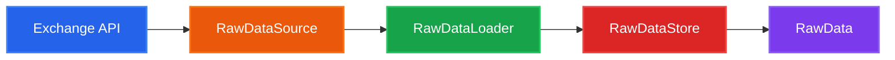

# Data Sources

SignalFlow provides async clients and loaders for downloading historical OHLCV data from cryptocurrency exchanges.

---

## Architecture Overview

The data module follows a clear separation of concerns:



| Component | Responsibility |
|-----------|---------------|
| `RawDataSource` | API client (fetch klines, handle rate limits) |
| `RawDataLoader` | Orchestrates download/sync to storage |
| `RawDataStore` | Persists data (DuckDB, SQLite, PostgreSQL) |
| `RawData` | Immutable container for strategy consumption |

---

## Built-in Exchange Sources

### Binance

```python
from signalflow.data.source import BinanceClient, BinanceSpotLoader
from signalflow.data.raw_store import DuckDbRawStore
from datetime import datetime
from pathlib import Path

# Direct API client usage
async with BinanceClient() as client:
    klines = await client.get_klines("BTCUSDT", "1h")

    # With date range
    klines = await client.get_klines_range(
        pair="BTCUSDT",
        timeframe="1m",
        start_time=datetime(2024, 1, 1),
        end_time=datetime(2024, 1, 31),
    )

# Using loader for automated sync
store = DuckDbRawStore(db_path=Path("data/spot.duckdb"))
loader = BinanceSpotLoader(store_path=Path("data/spot.duckdb"))

await loader.sync(
    pairs=["BTCUSDT", "ETHUSDT"],
    days=30,
    fill_gaps=True,
)
```

Available loaders:

| Loader | Market Type | Base URL |
|--------|-------------|----------|
| `BinanceSpotLoader` | Spot | `api.binance.com` |
| `BinanceFuturesUsdtLoader` | USDT-M Futures | `fapi.binance.com` |
| `BinanceFuturesCoinLoader` | COIN-M Futures | `dapi.binance.com` |

### Bybit

```python
from signalflow.data.source import BybitClient, BybitSpotLoader

async with BybitClient() as client:
    klines = await client.get_klines("BTCUSDT", timeframe="1h")

    klines = await client.get_klines_range(
        pair="BTCUSDT",
        category="spot",  # or "linear" for futures
        timeframe="1m",
        start_time=datetime(2024, 1, 1),
        end_time=datetime(2024, 1, 31),
    )
```

| Loader | Category |
|--------|----------|
| `BybitSpotLoader` | `spot` |
| `BybitFuturesLoader` | `linear` |

### OKX

```python
from signalflow.data.source import OkxClient, OkxSpotLoader

async with OkxClient() as client:
    # OKX uses "BTC-USDT" format
    klines = await client.get_klines("BTC-USDT", timeframe="1h")
```

| Loader | Instrument Suffix |
|--------|------------------|
| `OkxSpotLoader` | (none) |
| `OkxFuturesLoader` | `-SWAP` |

---

## Virtual Data Provider

For testing without API access:

```python
from signalflow.data.source import VirtualDataProvider, generate_ohlcv
from signalflow.data.raw_store import DuckDbRawStore
from pathlib import Path

store = DuckDbRawStore(db_path=Path("test.duckdb"))

# Generate synthetic data
provider = VirtualDataProvider(store=store, seed=42)
provider.download(pairs=["BTCUSDT", "ETHUSDT"], n_bars=10_000)

# Or generate in-memory
ohlcv_data = generate_ohlcv(n_bars=1000, seed=42)
```

---

## Creating a Custom Source

### Step 1: Implement RawDataSource

```python
from dataclasses import dataclass, field
from datetime import datetime
from typing import Optional
import aiohttp

from signalflow.core import sf_component
from signalflow.data.source.base import RawDataSource
from signalflow.data.source._helpers import dt_to_ms_utc, ms_to_dt_utc_naive


@dataclass
@sf_component(name="kraken")
class KrakenClient(RawDataSource):
    """Async client for Kraken REST API."""

    base_url: str = "https://api.kraken.com"
    max_retries: int = 3
    _session: Optional[aiohttp.ClientSession] = field(default=None, repr=False)

    async def __aenter__(self):
        self._session = aiohttp.ClientSession()
        return self

    async def __aexit__(self, *args):
        if self._session:
            await self._session.close()
            self._session = None

    async def get_klines(
        self,
        pair: str,
        timeframe: str = "1m",
        since: Optional[datetime] = None,
    ) -> list[dict]:
        """Fetch OHLCV data from Kraken."""
        if self._session is None:
            raise RuntimeError("KrakenClient must be used as async context manager")

        # Kraken uses different pair format (XXBTZUSD)
        kraken_pair = self._to_kraken_pair(pair)

        # Kraken interval in minutes
        interval_map = {"1m": 1, "5m": 5, "15m": 15, "1h": 60, "4h": 240, "1d": 1440}
        interval = interval_map.get(timeframe)
        if interval is None:
            raise ValueError(f"Unsupported timeframe: {timeframe}")

        params = {"pair": kraken_pair, "interval": interval}
        if since:
            params["since"] = int(since.timestamp())

        async with self._session.get(
            f"{self.base_url}/0/public/OHLC",
            params=params,
        ) as resp:
            data = await resp.json()

            if data.get("error"):
                raise RuntimeError(f"Kraken API error: {data['error']}")

            result_key = list(data["result"].keys())[0]
            if result_key == "last":
                result_key = list(data["result"].keys())[1]

            rows = data["result"][result_key]

        # Transform to canonical format
        klines = []
        for row in rows:
            klines.append({
                "timestamp": datetime.fromtimestamp(row[0]),
                "open": float(row[1]),
                "high": float(row[2]),
                "low": float(row[3]),
                "close": float(row[4]),
                "volume": float(row[6]),
                "trades": int(row[7]) if len(row) > 7 else 0,
            })

        return klines

    def _to_kraken_pair(self, pair: str) -> str:
        """Convert BTCUSDT to XXBTZUSD format."""
        # Simplified mapping
        mapping = {
            "BTCUSDT": "XXBTZUSD",
            "ETHUSDT": "XETHZUSD",
            "BTCUSD": "XXBTZUSD",
        }
        return mapping.get(pair, pair)
```

### Step 2: Implement RawDataLoader

```python
from dataclasses import dataclass
from datetime import datetime, timedelta
from pathlib import Path
from typing import Optional

from signalflow.core import sf_component
from signalflow.data.source.base import RawDataLoader
from signalflow.data.raw_store import DuckDbRawStore


@dataclass
@sf_component(name="kraken/spot")
class KrakenSpotLoader(RawDataLoader):
    """Loader for Kraken spot data."""

    store_path: Path
    timeframe: str = "1m"
    _store: Optional[DuckDbRawStore] = None

    def __post_init__(self):
        self._store = DuckDbRawStore(db_path=self.store_path, data_type="spot")

    async def download(
        self,
        pairs: list[str],
        start: datetime,
        end: datetime,
    ):
        """Download historical data."""
        async with KrakenClient() as client:
            for pair in pairs:
                klines = await client.get_klines(
                    pair=pair,
                    timeframe=self.timeframe,
                    since=start,
                )

                # Filter by end date
                klines = [k for k in klines if k["timestamp"] <= end]

                if klines:
                    self._store.insert_klines(pair, klines)
                    print(f"Downloaded {len(klines)} klines for {pair}")

    async def sync(
        self,
        pairs: list[str],
        days: int = 7,
    ):
        """Sync latest data."""
        end = datetime.now()

        for pair in pairs:
            # Get last timestamp
            _, max_ts = self._store.get_time_bounds(pair)

            if max_ts:
                start = max_ts
            else:
                start = end - timedelta(days=days)

            await self.download(pairs=[pair], start=start, end=end)
```

### Step 3: Register and Use

```python
from signalflow.core.registry import default_registry
from signalflow.core.enums import SfComponentType

# Components are auto-registered via @sf_component decorator
# Or register manually:
default_registry.register(
    SfComponentType.RAW_DATA_SOURCE,
    "kraken",
    KrakenClient,
)

default_registry.register(
    SfComponentType.RAW_DATA_LOADER,
    "kraken/spot",
    KrakenSpotLoader,
)

# Usage
loader = KrakenSpotLoader(store_path=Path("data/kraken.duckdb"))
await loader.sync(pairs=["BTCUSDT", "ETHUSDT"], days=30)
```

---

## Shared Utilities

The `_helpers` module provides common datetime utilities:

```python
from signalflow.data.source._helpers import (
    TIMEFRAME_MS,        # {"1m": 60_000, "1h": 3_600_000, ...}
    dt_to_ms_utc,        # datetime -> milliseconds
    ms_to_dt_utc_naive,  # milliseconds -> datetime (UTC naive)
    ensure_utc_naive,    # normalize timezone
)

# Convert datetime to milliseconds
ms = dt_to_ms_utc(datetime(2024, 1, 1))  # 1704067200000

# Convert back
dt = ms_to_dt_utc_naive(1704067200000)  # datetime(2024, 1, 1, 0, 0)

# Normalize timezone
dt_naive = ensure_utc_naive(datetime(2024, 1, 1, tzinfo=timezone.utc))
```

---

## Best Practices

### Rate Limiting

```python
import asyncio

@dataclass
class MyClient(RawDataSource):
    requests_per_minute: int = 60
    _last_request: float = 0

    async def _rate_limit(self):
        elapsed = time.time() - self._last_request
        min_interval = 60 / self.requests_per_minute
        if elapsed < min_interval:
            await asyncio.sleep(min_interval - elapsed)
        self._last_request = time.time()

    async def get_klines(self, pair: str):
        await self._rate_limit()
        # ... make request
```

### Retry Logic

```python
async def get_klines(self, pair: str):
    last_error = None

    for attempt in range(self.max_retries):
        try:
            async with self._session.get(url, params=params) as resp:
                if resp.status == 429:  # Rate limited
                    await asyncio.sleep(2 ** attempt)
                    continue

                if resp.status != 200:
                    raise RuntimeError(f"HTTP {resp.status}")

                return await resp.json()

        except aiohttp.ClientError as e:
            last_error = e
            await asyncio.sleep(1)

    raise RuntimeError(f"Failed after {self.max_retries} attempts: {last_error}")
```

### Timestamp Convention

All SignalFlow sources use **close time** as the canonical timestamp:

```python
# Binance returns open time in k[0], close time in k[6]
close_ms = int(kline[6])
timestamp = ms_to_dt_utc_naive(close_ms)

# For sources returning open time, add timeframe duration
open_time = datetime(2024, 1, 1, 10, 0)
close_time = open_time + timedelta(minutes=1)  # for 1m candle
```

---

## API Reference

See the full API documentation:

- [`RawDataSource`](../api/data.md) - Base class for data sources
- [`RawDataLoader`](../api/data.md) - Base class for data loaders
- [`BinanceClient`](../api/data.md) - Binance API client
- [`BybitClient`](../api/data.md) - Bybit API client
- [`OkxClient`](../api/data.md) - OKX API client
