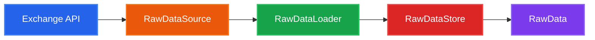

# Data Sources

SignalFlow provides async clients and loaders for downloading historical OHLCV data from cryptocurrency exchanges.

---

## Architecture Overview

The data module follows a clear separation of concerns:



| Component | Responsibility |
|-----------|---------------|
| `RawDataSource` | API client (fetch klines, handle rate limits) |
| `RawDataLoader` | Orchestrates download/sync to storage |
| `RawDataStore` | Persists data (DuckDB, SQLite, PostgreSQL) |
| `RawData` | Immutable container for strategy consumption |

---

## Built-in Exchange Sources

### Binance

```python
from signalflow.data.source import BinanceClient, BinanceSpotLoader
from signalflow.data.raw_store import DuckDbRawStore
from datetime import datetime
from pathlib import Path

# Direct API client usage
async with BinanceClient() as client:
    klines = await client.get_klines("BTCUSDT", "1h")

    # With date range
    klines = await client.get_klines_range(
        pair="BTCUSDT",
        timeframe="1m",
        start_time=datetime(2024, 1, 1),
        end_time=datetime(2024, 1, 31),
    )

# Using loader for automated sync
store = DuckDbRawStore(db_path=Path("data/spot.duckdb"))
loader = BinanceSpotLoader(store_path=Path("data/spot.duckdb"))

await loader.sync(
    pairs=["BTCUSDT", "ETHUSDT"],
    days=30,
    fill_gaps=True,
)
```

Available loaders:

| Loader | Market Type | Base URL |
|--------|-------------|----------|
| `BinanceSpotLoader` | Spot | `api.binance.com` |
| `BinanceFuturesUsdtLoader` | USDT-M Futures | `fapi.binance.com` |
| `BinanceFuturesCoinLoader` | COIN-M Futures | `dapi.binance.com` |

### Bybit

```python
from signalflow.data.source import BybitClient, BybitSpotLoader

async with BybitClient() as client:
    klines = await client.get_klines("BTCUSDT", timeframe="1h")

    klines = await client.get_klines_range(
        pair="BTCUSDT",
        category="spot",  # or "linear" for futures
        timeframe="1m",
        start_time=datetime(2024, 1, 1),
        end_time=datetime(2024, 1, 31),
    )
```

| Loader | Category | Symbols |
|--------|----------|---------|
| `BybitSpotLoader` | `spot` | BTCUSDT, ETHUSDT |
| `BybitFuturesLoader` | `linear` | BTCUSDT, ETHUSDT |
| `BybitFuturesInverseLoader` | `inverse` | BTCUSD, ETHUSD |

### OKX

```python
from signalflow.data.source import OkxClient, OkxSpotLoader

async with OkxClient() as client:
    # OKX uses "BTC-USDT" format
    klines = await client.get_klines("BTC-USDT", timeframe="1h")
```

| Loader | Instrument Suffix |
|--------|------------------|
| `OkxSpotLoader` | (none) |
| `OkxFuturesLoader` | `-SWAP` |

### Deribit

```python
from signalflow.data.source import DeribitClient, DeribitFuturesLoader

async with DeribitClient() as client:
    # Deribit uses BTC-PERPETUAL format
    klines = await client.get_klines("BTC-PERPETUAL", timeframe="1h")

    # Get available instruments
    pairs = await client.get_pairs(currency="BTC", kind="future")
```

| Loader | Instruments |
|--------|-------------|
| `DeribitFuturesLoader` | BTC-PERPETUAL, ETH-PERPETUAL |

### Kraken

```python
from signalflow.data.source import KrakenClient, KrakenSpotLoader

async with KrakenClient() as client:
    # Kraken spot uses XXBTZUSD format (auto-converted)
    klines = await client.get_spot_klines("XXBTZUSD", timeframe="1h")

    # Kraken futures uses pi_xbtusd format
    klines = await client.get_futures_klines("PI_XBTUSD", timeframe="1h")
```

| Loader | Market Type | Symbols |
|--------|-------------|---------|
| `KrakenSpotLoader` | Spot | XXBTZUSD, XETHZUSD |
| `KrakenFuturesLoader` | Futures | PI_XBTUSD, PI_ETHUSD |

!!! note "Kraken timestamps"
    Kraken uses **seconds** for timestamps (not milliseconds like most exchanges).

### Hyperliquid

```python
from signalflow.data.source import HyperliquidClient, HyperliquidFuturesLoader

async with HyperliquidClient() as client:
    # Hyperliquid uses simple coin names: BTC, ETH
    klines = await client.get_klines("BTC", timeframe="1h")

    # Get all available coins
    coins = await client.get_pairs()
```

| Loader | Market Type |
|--------|-------------|
| `HyperliquidFuturesLoader` | Perpetuals (DEX) |

!!! note "Hyperliquid limits"
    Maximum 5000 historical candles available.

### WhiteBIT

```python
from signalflow.data.source import WhitebitClient, WhitebitSpotLoader, WhitebitFuturesLoader

async with WhitebitClient() as client:
    # WhiteBIT uses BTC_USDT format
    klines = await client.get_klines("BTC_USDT", timeframe="1h")

    # Futures use BTC_PERP format
    futures_pairs = await client.get_futures_pairs()
```

| Loader | Market Type | Symbols |
|--------|-------------|---------|
| `WhitebitSpotLoader` | Spot | BTC_USDT, ETH_USDT |
| `WhitebitFuturesLoader` | Futures | BTC_PERP, ETH_PERP |

!!! note "WhiteBIT timestamps"
    WhiteBIT uses **seconds** for timestamps (not milliseconds).

---

## Virtual Data Provider

For testing without API access:

```python
from signalflow.data.source import VirtualDataProvider, generate_ohlcv
from signalflow.data.raw_store import DuckDbRawStore
from pathlib import Path

store = DuckDbRawStore(db_path=Path("test.duckdb"))

# Generate synthetic data
provider = VirtualDataProvider(store=store, seed=42)
provider.download(pairs=["BTCUSDT", "ETHUSDT"], n_bars=10_000)

# Or generate in-memory
ohlcv_data = generate_ohlcv(n_bars=1000, seed=42)
```

---

## Creating a Custom Source

### Step 1: Implement RawDataSource

```python
from dataclasses import dataclass, field
from datetime import datetime
from typing import Optional
import aiohttp

from signalflow.core import sf_component
from signalflow.data.source.base import RawDataSource
from signalflow.data.source._helpers import dt_to_ms_utc, ms_to_dt_utc_naive


@dataclass
@sf_component(name="myexchange")
class MyExchangeClient(RawDataSource):
    """Async client for custom exchange REST API."""

    base_url: str = "https://api.myexchange.com"
    max_retries: int = 3
    _session: Optional[aiohttp.ClientSession] = field(default=None, repr=False)

    async def __aenter__(self):
        self._session = aiohttp.ClientSession()
        return self

    async def __aexit__(self, *args):
        if self._session:
            await self._session.close()
            self._session = None

    async def get_klines(
        self,
        pair: str,
        timeframe: str = "1m",
        start_time: Optional[datetime] = None,
    ) -> list[dict]:
        """Fetch OHLCV data from exchange."""
        if self._session is None:
            raise RuntimeError("Must be used as async context manager")

        interval_map = {"1m": "1", "5m": "5", "15m": "15", "1h": "60", "4h": "240", "1d": "1440"}
        interval = interval_map.get(timeframe)
        if interval is None:
            raise ValueError(f"Unsupported timeframe: {timeframe}")

        params = {"symbol": pair, "interval": interval}
        if start_time:
            params["startTime"] = dt_to_ms_utc(start_time)

        async with self._session.get(
            f"{self.base_url}/api/v1/klines",
            params=params,
        ) as resp:
            if resp.status != 200:
                raise RuntimeError(f"API error: {resp.status}")

            data = await resp.json()

        # Transform to canonical format (close time convention)
        klines = []
        for row in data:
            # Assuming response: [open_time_ms, o, h, l, c, volume]
            open_time_ms = int(row[0])
            tf_ms = int(interval) * 60 * 1000
            close_time_ms = open_time_ms + tf_ms

            klines.append({
                "timestamp": ms_to_dt_utc_naive(close_time_ms),
                "open": float(row[1]),
                "high": float(row[2]),
                "low": float(row[3]),
                "close": float(row[4]),
                "volume": float(row[5]),
                "trades": 0,  # Not provided
            })

        return klines
```

### Step 2: Implement RawDataLoader

```python
from dataclasses import dataclass, field
from datetime import datetime, timedelta
from pathlib import Path
from typing import Optional

from signalflow.core import sf_component
from signalflow.data.source.base import RawDataLoader
from signalflow.data.raw_store import DuckDbSpotStore


@dataclass
@sf_component(name="myexchange/spot")
class MyExchangeSpotLoader(RawDataLoader):
    """Loader for custom exchange spot data."""

    store: DuckDbSpotStore = field(
        default_factory=lambda: DuckDbSpotStore(db_path=Path("data/myexchange.duckdb"))
    )
    timeframe: str = "1m"

    async def get_pairs(self) -> list[str]:
        """Get available trading pairs."""
        async with MyExchangeClient() as client:
            # Implement pair fetching
            return ["BTCUSDT", "ETHUSDT"]

    async def download(
        self,
        pairs: list[str],
        days: Optional[int] = None,
        start: Optional[datetime] = None,
        end: Optional[datetime] = None,
        fill_gaps: bool = True,
    ):
        """Download historical data."""
        if end is None:
            end = datetime.utcnow()
        if start is None:
            start = end - timedelta(days=days or 7)

        async with MyExchangeClient() as client:
            for pair in pairs:
                klines = await client.get_klines(
                    pair=pair,
                    timeframe=self.timeframe,
                    start_time=start,
                )

                # Filter by end date
                klines = [k for k in klines if k["timestamp"] <= end]

                if klines:
                    self.store.insert_klines(pair, klines)
                    print(f"Downloaded {len(klines)} klines for {pair}")

    async def sync(
        self,
        pairs: list[str],
        update_interval_sec: int = 60,
    ):
        """Continuously sync latest data."""
        # Implementation...
        pass
```

### Step 3: Register and Use

```python
from signalflow.core.registry import default_registry
from signalflow.core.enums import SfComponentType

# Components are auto-registered via @sf_component decorator
# Or register manually:
default_registry.register(
    SfComponentType.RAW_DATA_SOURCE,
    "myexchange",
    MyExchangeClient,
)

default_registry.register(
    SfComponentType.RAW_DATA_LOADER,
    "myexchange/spot",
    MyExchangeSpotLoader,
)

# Usage
loader = MyExchangeSpotLoader()
await loader.download(pairs=["BTCUSDT", "ETHUSDT"], days=30)
```

---

## Shared Utilities

The `_helpers` module provides common datetime utilities:

```python
from signalflow.data.source._helpers import (
    TIMEFRAME_MS,        # {"1m": 60_000, "1h": 3_600_000, ...}
    dt_to_ms_utc,        # datetime -> milliseconds
    ms_to_dt_utc_naive,  # milliseconds -> datetime (UTC naive)
    ensure_utc_naive,    # normalize timezone
    # Seconds-based helpers (for Kraken, WhiteBIT)
    dt_to_sec_utc,       # datetime -> seconds
    sec_to_dt_utc_naive, # seconds -> datetime (UTC naive)
)

# Convert datetime to milliseconds
ms = dt_to_ms_utc(datetime(2024, 1, 1))  # 1704067200000

# Convert back
dt = ms_to_dt_utc_naive(1704067200000)  # datetime(2024, 1, 1, 0, 0)

# For seconds-based exchanges (Kraken, WhiteBIT)
sec = dt_to_sec_utc(datetime(2024, 1, 1))  # 1704067200
dt = sec_to_dt_utc_naive(1704067200)  # datetime(2024, 1, 1, 0, 0)

# Normalize timezone
dt_naive = ensure_utc_naive(datetime(2024, 1, 1, tzinfo=timezone.utc))
```

### Pair Normalization Helpers

Each exchange has pair normalization utilities:

```python
from signalflow.data.source._helpers import (
    # Kraken
    normalize_kraken_spot_pair,    # XXBTZUSD -> BTCUSD
    normalize_kraken_futures_pair, # pi_xbtusd -> BTCUSD
    # Deribit
    normalize_deribit_pair,        # BTC-PERPETUAL -> BTCUSD
    to_deribit_instrument,         # BTCUSD -> BTC-PERPETUAL
    # Hyperliquid
    normalize_hyperliquid_pair,    # BTC -> BTCUSD
    to_hyperliquid_coin,           # BTCUSD -> BTC
    # WhiteBIT
    normalize_whitebit_pair,       # BTC_USDT -> BTCUSDT
    normalize_whitebit_futures_pair, # BTC_PERP -> BTCUSD
)
```

---

## Best Practices

### Rate Limiting

```python
import asyncio

@dataclass
class MyClient(RawDataSource):
    requests_per_minute: int = 60
    _last_request: float = 0

    async def _rate_limit(self):
        elapsed = time.time() - self._last_request
        min_interval = 60 / self.requests_per_minute
        if elapsed < min_interval:
            await asyncio.sleep(min_interval - elapsed)
        self._last_request = time.time()

    async def get_klines(self, pair: str):
        await self._rate_limit()
        # ... make request
```

### Retry Logic

```python
async def get_klines(self, pair: str):
    last_error = None

    for attempt in range(self.max_retries):
        try:
            async with self._session.get(url, params=params) as resp:
                if resp.status == 429:  # Rate limited
                    await asyncio.sleep(2 ** attempt)
                    continue

                if resp.status != 200:
                    raise RuntimeError(f"HTTP {resp.status}")

                return await resp.json()

        except aiohttp.ClientError as e:
            last_error = e
            await asyncio.sleep(1)

    raise RuntimeError(f"Failed after {self.max_retries} attempts: {last_error}")
```

### Timestamp Convention

All SignalFlow sources use **close time** as the canonical timestamp:

```python
# Binance returns open time in k[0], close time in k[6]
close_ms = int(kline[6])
timestamp = ms_to_dt_utc_naive(close_ms)

# For sources returning open time, add timeframe duration
open_time = datetime(2024, 1, 1, 10, 0)
close_time = open_time + timedelta(minutes=1)  # for 1m candle
```

---

## API Reference

See the full API documentation:

- [`RawDataSource`](../api/data.md) - Base class for data sources
- [`RawDataLoader`](../api/data.md) - Base class for data loaders
- [`BinanceClient`](../api/data.md) - Binance API client
- [`BybitClient`](../api/data.md) - Bybit API client
- [`OkxClient`](../api/data.md) - OKX API client
- [`DeribitClient`](../api/data.md) - Deribit API client
- [`KrakenClient`](../api/data.md) - Kraken API client
- [`HyperliquidClient`](../api/data.md) - Hyperliquid API client
- [`WhitebitClient`](../api/data.md) - WhiteBIT API client
