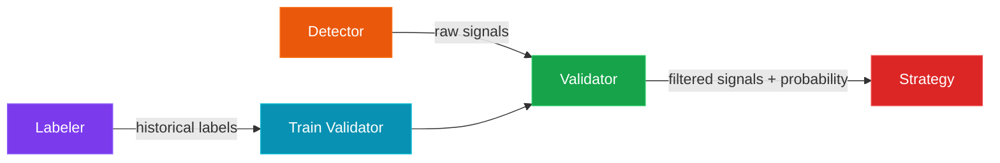
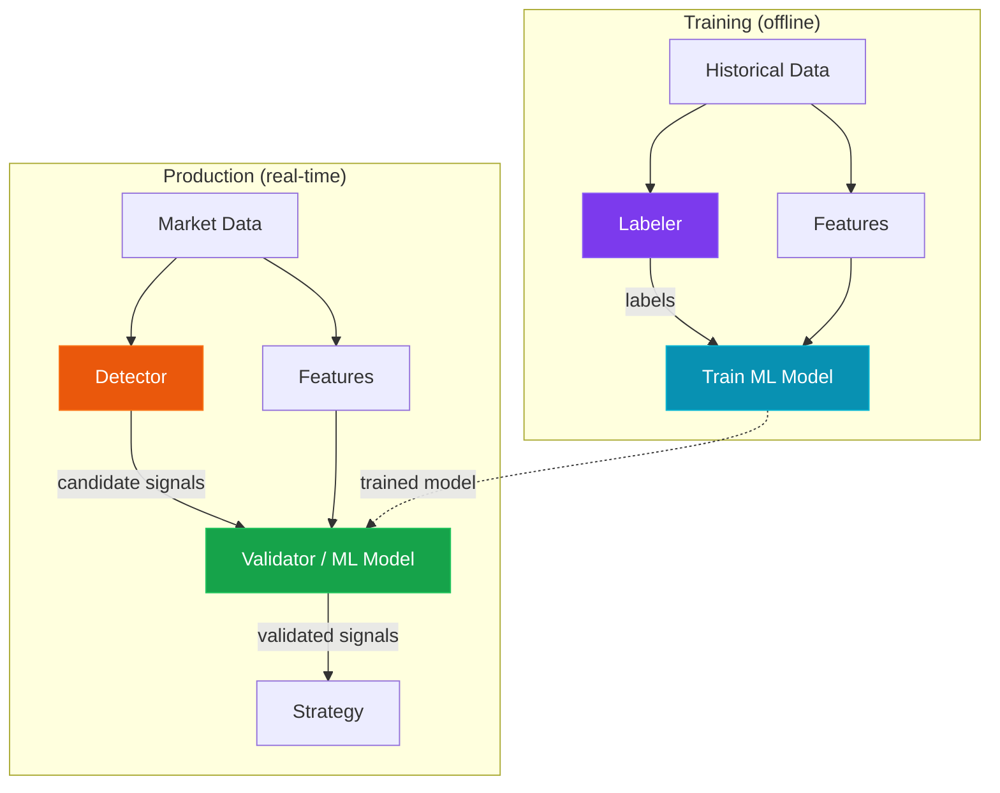
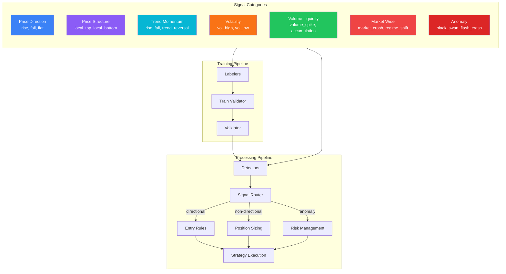

# Signal Architecture & Meta-Labeling

This page describes the core philosophy behind SignalFlow: the signal-driven
approach to algorithmic trading based on Marcos Lopez de Prado's meta-labeling
methodology.

---

## The Core Idea

Traditional algorithmic trading systems make binary decisions: buy or sell based
on some rule. SignalFlow takes a fundamentally different approach inspired by
machine learning research in quantitative finance:

1. **Signal Detection** -- identify *potential* market changes
2. **Signal Validation** -- use ML to estimate the *probability* that a signal is correct
3. **Strategy Execution** -- use validated signals to make trading decisions

This separation is critical: the detector's job is to have **high recall**
(detect as many real opportunities as possible), while the validator's job is to
have **high precision** (filter out false positives).



---

## What is a Signal?

A **signal** is a prediction that a specific type of market change is occurring
or is about to occur. Signals are **not** trading orders -- they are
informational events that the strategy layer interprets.

### Two-Level Signal Model

SignalFlow uses a two-level signal model:

| Level | Field | Type | Purpose |
|-------|-------|------|---------|
| **Category** | `signal_category` | `SignalCategory` enum | Broad classification for routing |
| **Type** | `signal_type` | `str` | Specific signal value within category |

```python
from signalflow.core.enums import SignalCategory

# A signal has both a category and a type
signal_category = SignalCategory.PRICE_DIRECTION  # broad: about price movement
signal_type = "rise"                               # specific: price is rising
```

This design allows the system to:

- **Route** signals based on category (e.g., directional signals go to entry
  rules, volatility signals go to position sizing)
- **Extend** signal types without modifying core code (any string is valid as a
  `signal_type`)
- Keep **multiple signal categories per timestamp** (e.g., a bar can
  simultaneously have a `price_direction=rise` signal and a `volatility=vol_high`
  signal)

### Signal Categories

| Category | Description | Example Types |
|----------|-------------|---------------|
| `PRICE_DIRECTION` | Price movement direction | `rise`, `fall`, `flat` |
| `PRICE_STRUCTURE` | Price patterns and extrema | `local_top`, `local_bottom`, `breakout_up` |
| `TREND_MOMENTUM` | Trend state and momentum | `rise`, `fall`, `trend_reversal` |
| `VOLATILITY` | Volatility regime | `vol_high`, `vol_low`, `vol_expansion` |
| `VOLUME_LIQUIDITY` | Volume and liquidity patterns | `volume_spike`, `accumulation` |
| `MARKET_WIDE` | Cross-pair market events | `market_crash`, `regime_shift` |
| `ANOMALY` | Black swans and anomalies | `black_swan`, `flash_crash` |

The full registry of known signal types is in
`signalflow.core.signal_registry.KNOWN_SIGNALS`. This registry is **advisory** --
new signal types can be used without modifying it.

### Null vs FLAT: Uncertainty vs Market State

A critical distinction in SignalFlow:

| Value | Meaning | Example |
|-------|---------|---------|
| `"flat"` | The market is moving sideways. This is a **valid signal** -- a real market state. | After a strong trend, price consolidates in a range. The labeler identifies this as `"flat"`. |
| `null` | The labeler/detector **doesn't know**. Epistemic uncertainty. | An unexpected tweet from a public figure causes unpredictable volatility. The labeler cannot determine direction and outputs `null`. |

This matters for ML training: `"flat"` is a valid class label that the model
should learn to predict. `null` means "skip this sample" -- the labeler has no
information about this timestamp, and the model should not be trained on it.

```python
# FLAT = real market state (valid signal)
pl.lit("flat").alias("signal_type")     # "I know the market is sideways"

# null = uncertainty (no information)
pl.lit(None, dtype=pl.Utf8).alias("signal_type")  # "I don't know what's happening"
```

---

## The Dual Pipeline: Labelers vs Detectors

Every signal category in SignalFlow can have two complementary implementations:

### Labeler (Historical, Forward-Looking)

- Lives in `signalflow.target` module
- **Knows the future** -- uses data after timestamp `t` to label `t`
- Purpose: generate **training labels** for ML models
- Extends `Labeler` base class, implements `compute_group()`
- **Length-preserving**: output has the same number of rows as input

```python
from signalflow.target import AnomalyLabeler

labeler = AnomalyLabeler(
    threshold_return_std=4.0,
    horizon=60,
    mask_to_signals=False,
)
labeled_df = labeler.compute(ohlcv_df)
# Each row gets a label: "black_swan", "flash_crash", or null
```

### Detector (Real-Time, Backward-Looking)

- Lives in `signalflow.detector` module
- **Only uses past and current data** -- safe for live trading
- Purpose: generate **trading signals** in real-time
- Extends `SignalDetector` base class, implements `detect()`
- Outputs a `Signals` DataFrame (only rows with detected signals)

```python
from signalflow.detector import AnomalyDetector

detector = AnomalyDetector(
    threshold_return_std=4.0,
    vol_window=1440,
)
signals = detector.run(raw_data_view)
# Only bars with anomalies are returned
```

### Why Both?

The labeler knows the future, so its labels are **more accurate** but can only
be used for training. The detector works in real-time but is **less precise**.

The training pipeline:

1. Run **labeler** on historical data to create perfect (or near-perfect) labels
2. Train a **validator** (ML model) to predict labeler output from features
3. In production, the **detector** generates candidate signals
4. The **validator** filters and scores them



---

## Available Labelers & Detectors

### Price Direction

The most basic signal category. Predicts whether price will rise or fall.

| Component | Algorithm | Signal Types |
|-----------|-----------|--------------|
| `FixedHorizonLabeler` | Forward return sign over N bars | `rise`, `fall`, `null` |
| `TripleBarrierLabeler` | Triple barrier method (De Prado) | `rise`, `fall`, `null` |
| `TakeProfitLabeler` | Symmetric TP/SL barrier | `rise`, `fall`, `null` |
| `TrendScanningLabeler` | OLS t-statistic across windows (De Prado) | `rise`, `fall`, `null` |
| `ExampleSmaCrossDetector` | SMA crossover (real-time) | `rise`, `fall`, `none` |

### Anomaly / Black Swan

Detects extreme, unexpected market events.

| Component | Algorithm | Signal Types |
|-----------|-----------|--------------|
| `AnomalyLabeler` | Forward return magnitude vs rolling vol | `black_swan`, `flash_crash`, `null` |
| `AnomalyDetector` | Current return magnitude vs rolling vol | `black_swan`, `flash_crash` |

### Volatility Regime

Classifies current volatility state.

| Component | Algorithm | Signal Types |
|-----------|-----------|--------------|
| `VolatilityRegimeLabeler` | Forward realized vol percentile | `vol_high`, `vol_low`, `null` |
| `VolatilityDetector` | Backward realized vol percentile | `vol_high`, `vol_low` |

### Price Structure

Identifies local price extrema (tops and bottoms).

| Component | Algorithm | Signal Types |
|-----------|-----------|--------------|
| `StructureLabeler` | Symmetric window extrema (look-ahead) | `local_top`, `local_bottom`, `null` |
| `StructureDetector` | Backward zigzag with confirmation delay | `local_top`, `local_bottom` |

### Volume Regime

Classifies volume patterns.

| Component | Algorithm | Signal Types |
|-----------|-----------|--------------|
| `VolumeRegimeLabeler` | Forward volume ratio vs SMA | `volume_spike`, `volume_drought`, `null` |

---

## Imperfect Labels Are Expected

A fundamental principle of SignalFlow:

!!! warning "Labels are not ground truth"
    No labeler produces perfect labels. Different labelers can **contradict**
    each other for the same timestamp. Some labelers have large periods of
    `null` (uncertainty). This is by design.

The philosophy:

- Each labeler implements a **specific definition** of what constitutes a signal
- The `FixedHorizonLabeler` says "rise" means the price went up over N bars
- The `TrendScanningLabeler` says "rise" means there's a statistically
  significant upward OLS trend
- The `TripleBarrierLabeler` says "rise" means the take-profit barrier was hit
  first

These definitions **do not always agree**. A model that can predict **any one**
of these labelers with reasonable accuracy is considered a good result.

The task of choosing the right labeler for a given model architecture is itself
an important research question. Different model architectures may perform better
with different labeling strategies:

- Linear models may work best with `FixedHorizonLabeler`
- Sequence models (LSTM, Transformer) may benefit from `TrendScanningLabeler`
- Tree models may handle the noise in `TripleBarrierLabeler` well

---

## Meta-Labeling: The Two-Stage Approach

De Prado's meta-labeling methodology works in two stages:

### Stage 1: Primary Model (Detector)

The primary model detects the **direction** of potential trades. It should
have high recall -- it's better to detect too many signals than to miss real
ones.

```python
from signalflow.detector import ExampleSmaCrossDetector

detector = ExampleSmaCrossDetector(fast_period=20, slow_period=50)
signals = detector.run(raw_data_view)
# Many signals, some false positives
```

### Stage 2: Secondary Model (Validator)

The secondary model (meta-labeler) predicts the **probability of success** for
each signal from the primary model. It acts as a filter.

```python
from signalflow.validator import SklearnSignalValidator

validator = SklearnSignalValidator(model_type="lightgbm")
validator.fit(X_train=features, y_train=labels)

validated = validator.validate_signals(signals, features)
# Each signal now has a probability estimate
```

### Combined in Strategy

The `SignalAggregator` supports a dedicated `META_LABELING` voting mode for
combining detector signals with validator confidence:

```python
from signalflow.strategy.component.entry.aggregation import (
    SignalAggregator, VotingMode,
)

aggregator = SignalAggregator(
    voting_mode=VotingMode.META_LABELING,
    probability_threshold=0.6,
)
combined = aggregator.aggregate([detector_signals, validator_signals])
# Direction from detector, confidence from validator
```

---

## From Signals to Actions

Not all signals map directly to buy/sell decisions. A `vol_high` signal doesn't
mean "buy" or "sell" -- it means "volatility is high", which might affect
position sizing or risk management.

The decision of **what to do** with a signal is the strategy layer's
responsibility. This logic can range from simple rules to complex RL policies:

- **Simple**: `rise -> BUY`, `fall -> SELL` (built into entry rules)
- **Contextual**: `vol_high + local_bottom -> BUY with larger size`
- **Learned**: RL model that optimizes actions over signal combinations

For simple directional trading, the entry rules (`SignalEntryRule`,
`FixedSizeEntryRule`) handle `rise`/`fall` signals directly. For complex
multi-signal strategies, use the `StrategyModel` protocol
([Model Integration](model-integration.md)) where a model receives the full
signal context and makes decisions.

The `DIRECTIONAL_SIGNAL_MAP` in `signalflow.core.signal_registry` provides an
advisory mapping of which signal types are inherently directional:

```python
from signalflow.core.signal_registry import DIRECTIONAL_SIGNAL_MAP

# Advisory reference -- not enforced by the system
DIRECTIONAL_SIGNAL_MAP = {
    "rise": "BUY", "fall": "SELL",
    "local_bottom": "BUY", "local_top": "SELL",
    "breakout_up": "BUY", "breakout_down": "SELL",
    "oversold": "BUY", "overbought": "SELL",
}
```

---

## Smooth Labeling (Planned)

Standard categorical labels (`"rise"`, `"fall"`) lose information about the
**magnitude** of the signal. A barely-rising market and a strongly-rising market
both get the same label.

Smooth labeling preserves this information:

```
signal_category = "price_direction"
signal_type = "rise"           # categorical (for routing and strategy logic)
signal_value = 0.73            # continuous (magnitude/confidence for ML training)
```

The `signal_type` remains categorical for routing purposes, while `signal_value`
(stored in the existing `signal` column of the `Signals` DataFrame) carries
the continuous magnitude. This improves ML training by providing a richer
target variable.

!!! info "Status"
    Smooth labeling is planned for a future release. The `TrendScanningLabeler`
    already provides a `t_stat` meta column that can serve as a continuous signal
    value when `include_meta=True`.

---

## Extending the Signal Taxonomy

Adding a new signal category requires minimal changes:

### 1. Create a Labeler

```python
from dataclasses import dataclass
from signalflow.core import sf_component
from signalflow.core.enums import SignalCategory
from signalflow.target.base import Labeler

@dataclass
@sf_component(name="my_custom_labeler")
class MyLabeler(Labeler):
    signal_category = SignalCategory.MARKET_WIDE  # or any category

    def compute_group(self, group_df, data_context=None):
        # Your forward-looking labeling algorithm
        ...
        return group_df.with_columns(
            pl.when(condition)
            .then(pl.lit("my_signal_type"))
            .otherwise(pl.lit(None, dtype=pl.Utf8))
            .alias(self.out_col)
        )
```

### 2. Create a Detector (optional)

```python
from dataclasses import dataclass, field
from signalflow.core import sf_component
from signalflow.core.enums import SignalCategory
from signalflow.detector.base import SignalDetector

@dataclass
@sf_component(name="my_custom_detector")
class MyDetector(SignalDetector):
    signal_category = SignalCategory.MARKET_WIDE
    allowed_signal_types: set[str] | None = field(
        default_factory=lambda: {"my_signal_type"}
    )

    def detect(self, features, context=None):
        # Your backward-looking detection algorithm
        ...
        return Signals(signals_df)
```

### 3. Register in signal_registry (optional)

Update `KNOWN_SIGNALS` and `DIRECTIONAL_SIGNAL_MAP` if the signal types should
be discoverable or have directional mappings.

---

## Architecture Summary


