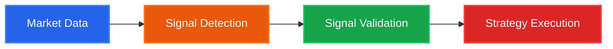

# SignalFlow - High-Performance Algorithmic Trading Framework

> Current stable version: **{{ project_version }}**

**SignalFlow** is a high-performance Python framework for
**algorithmic trading**, **quantitative finance**, and
**machine learning-based trading strategies**.


<div class="grid cards" markdown>

-   :material-lightning-bolt:{ .lg .middle } **High Performance**

    ---

    Powered by Polars for blazing-fast processing of large datasets (100+ trading pairs, 500k+ candles)

-   :material-puzzle:{ .lg .middle } **Modular Design**

    ---

    Component registry system with pluggable detectors, validators, features, and strategies

-   :material-chart-line:{ .lg .middle } **Production Ready**

    ---

    Seamless transition from research to production with unified backtesting and live trading interfaces

-   :material-brain:{ .lg .middle } **ML-Powered**

    ---

    Built-in support for scikit-learn, XGBoost, LightGBM, and PyTorch-based signal validation

</div>

---

## The Signal Processing Pipeline

SignalFlow organizes algorithmic trading into four distinct stages:



SignalFlow implements a four-stage algorithmic trading pipeline:
market data ingestion, signal detection, machine learning-based
signal validation, and strategy execution with risk management.

### 1. Data & Features
Load and process market data with efficient storage and feature engineering:

- Flexible data loaders (Binance Spot, Futures, custom sources)
- DuckDB and Parquet storage backends
- Technical indicators via pandas-ta and custom Polars extractors

### 2. Signal Detection
Identify potential trading opportunities from market patterns:

- Classical algorithms (SMA crossover, MACD, RSI thresholds)
- Pattern recognition (candlestick patterns, chart formations)
- Neural network outputs (CNN, LSTM, Transformer predictions)

### 3. Signal Validation (Meta-Labeling)
Filter signals using machine learning to predict success probability:

- Implements Lopez de Prado's meta-labeling methodology
- Support for scikit-learn, XGBoost, LightGBM classifiers
- Deep learning validators via PyTorch Lightning (signalflow-nn)

### 4. Strategy Execution
Convert validated signals into trades with risk management:

- **Entry/exit rules**:
  - Entry: Signal-based, model-driven, fixed-size
  - Exit: Take-profit/stop-loss, trailing stops, volatility-based, composite
- **Advanced position sizing**: Kelly Criterion, volatility targeting, risk parity, martingale/grid
- **Entry filters**: Regime, volatility, drawdown, correlation, time-of-day, price distance, signal accuracy
- **Signal aggregation**: Combine multiple detectors with voting modes (majority, weighted, unanimous, meta-labeling)
- **Real-time execution**: Paper trading with `RealtimeRunner` and monitoring/alerts
- **ML/RL integration**: External model support via `StrategyModel` protocol
- Unified interface for backtesting, paper trading, and live trading

---

## Real-Time Trading & Monitoring

SignalFlow v0.3.7+ includes production-ready infrastructure for paper and live trading:

### Paper Trading (Virtual Trading)
- **RealtimeRunner**: Async event loop for real-time bar processing
- **VirtualRealtimeBroker**: Simulated execution with order/fill logging
- **Data Sync**: Automatic background data updates from exchanges
- **State Persistence**: Crash recovery with checkpoint restoration

### Monitoring & Alerts
- **MaxDrawdownAlert**: Trigger on excessive drawdown
- **NoSignalsAlert**: Detect signal generation failures
- **StuckPositionAlert**: Alert on positions not exiting
- **Custom Metrics**: Track equity, win rate, Sharpe ratio in real-time

### External Model Integration
- **StrategyModel Protocol**: Integrate ML/RL models for automated decisions
- **ModelEntryRule / ModelExitRule**: Model-driven entry and exit logic
- **BacktestExporter**: Export training data (Parquet) for model development
- **Decision Caching**: Single model call per bar for consistent decisions

---

## Quick Example

```python
from datetime import datetime
from pathlib import Path

from signalflow.data.source import VirtualDataProvider
from signalflow.data.raw_store import DuckDbSpotStore
from signalflow.data import RawDataFactory
from signalflow.detector import ExampleSmaCrossDetector
from signalflow.strategy.runner import BacktestRunner
from signalflow.strategy.component.entry.signal import SignalEntryRule
from signalflow.strategy.component.exit.tp_sl import TakeProfitStopLossExit
from signalflow.strategy.broker import BacktestBroker
from signalflow.strategy.broker.executor import VirtualSpotExecutor

# Generate synthetic data (no API keys needed)
store = DuckDbSpotStore(db_path=Path("data.duckdb"))
VirtualDataProvider(store=store, seed=42).download(
    pairs=["BTCUSDT"], n_bars=10_000
)

# Load data
raw_data = RawDataFactory.from_duckdb_spot_store(
    spot_store_path=Path("data.duckdb"),
    pairs=["BTCUSDT"],
    start=datetime(2020, 1, 1),
    end=datetime(2030, 1, 1),
)

# Detect SMA crossover signals
detector = ExampleSmaCrossDetector(fast_period=20, slow_period=50)
signals = detector.run(raw_data.view())

# Backtest with entry/exit rules
runner = BacktestRunner(
    strategy_id="quickstart",
    broker=BacktestBroker(executor=VirtualSpotExecutor(fee_rate=0.001)),
    entry_rules=[SignalEntryRule(base_position_size=100.0, use_probability_sizing=False)],
    exit_rules=[TakeProfitStopLossExit(take_profit_pct=0.02, stop_loss_pct=0.01)],
    initial_capital=10_000.0,
)
state = runner.run(raw_data=raw_data, signals=signals)
print(f"Trades: {len(runner.trades)}, Final capital: ${state.capital:.2f}")
```

---

## Key Features

### :octicons-zap-16: Polars-First Performance
Core data processing uses Polars for extreme efficiency on large datasets, with seamless Pandas compatibility for prototyping.

### :octicons-plug-16: Component Registry
All components (detectors, validators, features) are registered via `@sf_component` decorator for easy customization:

```python
from signalflow.core import sf_component, SignalDetector

@sf_component(name="my_detector")
class CustomDetector(SignalDetector):
    def detect(self, data):
        # Your logic here
        return signals
```

### :octicons-beaker-16: Advanced Labeling
Built-in support for sophisticated labeling strategies:

- **Triple Barrier Method**: Combines take-profit, stop-loss, and time barriers
- **Fixed Horizon**: Label signals based on future returns
- **Signal masking**: Label only signal timestamps for efficient ML training
- Numba-accelerated for performance (45s → 0.3s on large datasets)

### :octicons-graph-16: 199+ Technical Indicators
The [signalflow-ta](ecosystem/signalflow-ta.md) extension provides production-grade technical analysis:

- Momentum, Overlap, Volatility, Volume, Trend, Statistics
- Physics-based indicators (energy, viscosity, impedance analogs)
- Preset pipeline factories for rapid feature engineering

### :octicons-rocket-16: Paper Trading & Monitoring
Production-ready infrastructure for risk-free validation:

- **RealtimeRunner**: Async loop with automatic data sync and signal processing
- **VirtualRealtimeBroker**: Simulated execution with comprehensive logging
- **Alert System**: Real-time monitoring of drawdown, positions, and signal quality
- **Crash Recovery**: State persistence and automatic restoration

### :octicons-cpu-16: ML/RL Model Integration
Protocol-based external model support:

- **StrategyModel Protocol**: Clean interface for ML/RL decision models
- **Model Rules**: `ModelEntryRule` and `ModelExitRule` for automated trading
- **Training Export**: Parquet export of backtest data for model development
- **Decision Caching**: Consistent model decisions across entry/exit phases

---

## Technology Stack

<div class="grid" markdown>

=== "Data Processing"
    - **Polars** - High-performance DataFrames
    - **Pandas** - Legacy compatibility & prototyping
    - **DuckDB** - Embedded analytics database
    - **NumPy** - Numerical computing

=== "Machine Learning"
    - **scikit-learn** - Classical ML models
    - **XGBoost** - Gradient boosting
    - **LightGBM** - Fast gradient boosting
    - **PyTorch** - Deep learning framework
    - **Lightning** - PyTorch training framework
    - **Optuna** - Hyperparameter optimization

=== "Trading Tools"
    - **signalflow-ta** - 199+ technical indicators
    - **pandas-ta** - Technical analysis foundation
    - **Numba** - JIT compilation for speed
    - **Plotly** - Interactive visualizations

=== "Infrastructure"
    - **DuckDB** - Local data storage
    - **SQLite / PostgreSQL** - Alternative storage backends
    - **Kedro** - Pipeline orchestration

</div>

---

## SignalFlow Ecosystem

SignalFlow is a multi-repository ecosystem with specialized extensions:

### signalflow-trading (Core) :material-package-variant-closed:
The main library with foundational components:

- Core data containers and abstractions (`RawData`, `Signals`, `RawDataView`)
- Exchange connectors (Binance Spot) and virtual data generation
- DuckDB, SQLite, and PostgreSQL storage backends
- Backtesting infrastructure with modular entry/exit rules
- Component registry system (`@sf_component`)

### [signalflow-ta](ecosystem/signalflow-ta.md) (Technical Analysis) :material-chart-bell-curve-cumulative:
199+ technical indicators across 8 modules:

- Momentum, Overlap, Volatility, Volume, Trend, Statistics
- Physics-based market analogs (energy, viscosity, impedance)
- Preset pipeline factories for rapid feature engineering
- AutoFeatureNormalizer for automatic scaling

### [signalflow-nn](ecosystem/signalflow-nn.md) (Neural Networks) :material-brain:
Deep learning validators built on PyTorch Lightning:

- Encoder + Head composition (LSTM, GRU + MLP, Attention, Residual)
- TemporalValidator for seamless signalflow integration
- Per-asset preprocessing with TimeSeriesPreprocessor
- Optuna hyperparameter tuning support

---

## Philosophy

**Minimize time from successful experiment to production deployment.**

SignalFlow bridges the research-production gap by:

1. **Unified API**: Same code works for backtesting and live trading
2. **Performance**: Polars-optimized for production-scale data
3. **Modularity**: Swap components without rewriting strategies
4. **Testability**: Every stage independently analyzable

---

## Getting Started

Ready to build your first trading strategy?

<div class="grid cards" markdown>

-   :material-download:{ .lg .middle } **[Installation Guide for SignalFlow](getting-started/installation.md)**

    ---

    Install SignalFlow and set up your development environment

-   :material-rocket-launch:{ .lg .middle } **[Quick Start Algorithmic Trading Example](quickstart.md)**

    ---

    Build your first signal detector and backtest a strategy

-   :material-strategy:{ .lg .middle } **[Advanced Strategy Components](guide/advanced-strategies.md)**

    ---

    Position sizing, entry filters, signal aggregation, and exit rules

-   :material-brain:{ .lg .middle } **[ML/RL Model Integration](guide/model-integration.md)**

    ---

    Integrate external ML/RL models with StrategyModel protocol

-   :material-puzzle:{ .lg .middle } **[Ecosystem Extensions](ecosystem/index.md)**

    ---

    signalflow-ta (199 indicators) and signalflow-nn (deep learning)

-   :material-code-braces:{ .lg .middle } **[SignalFlow API Reference](api/index.md)**

    ---

    Detailed documentation for all classes and methods

</div>

---

## Support & Community

- **GitHub**: [github.com/pathway2nothing/signalflow-trading](https://github.com/pathway2nothing/signalflow-trading)
- **Issues**: [Report bugs or request features](https://github.com/pathway2nothing/signalflow-trading/issues)
- **Email**: [pathway2nothing@gmail.com](mailto:pathway2nothing@gmail.com)

---

## License

SignalFlow is open source software released under the [MIT License](https://opensource.org/licenses/MIT).

---

!!! warning "Disclaimer"
    SignalFlow is provided for research purposes. Trading financial instruments carries risk. Past performance does not guarantee future results. Use at your own risk.

---

## FAQ

### What is SignalFlow used for?
SignalFlow is used to build, validate, and deploy algorithmic trading
strategies using classical indicators and machine learning models.

### Is SignalFlow suitable for production trading?
Yes. SignalFlow is designed with production pipelines, reproducibility,
and performance in mind, using Polars, DuckDB, and Kedro.

### Does SignalFlow support machine learning?
SignalFlow supports scikit-learn, XGBoost, LightGBM, and PyTorch-based
models for signal validation and meta-labeling.
