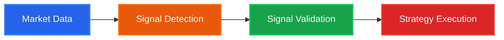

# SignalFlow — High-Performance Algorithmic Trading Framework

> Current stable version: **0.2.8**

**SignalFlow** is a high-performance Python framework for
**algorithmic trading**, **quantitative finance**, and
**machine learning-based trading strategies**.


<div class="grid cards" markdown>

-   :material-lightning-bolt:{ .lg .middle } **High Performance**

    ---

    Powered by Polars for blazing-fast processing of large datasets (100+ trading pairs, 500k+ candles)

-   :material-puzzle:{ .lg .middle } **Modular Design**

    ---

    Component registry system with pluggable detectors, validators, features, and strategies

-   :material-chart-line:{ .lg .middle } **Production Ready**

    ---

    Seamless transition from research to production with unified backtesting and live trading interfaces

-   :material-brain:{ .lg .middle } **ML-Powered**

    ---

    Built-in support for scikit-learn, XGBoost, LightGBM, and PyTorch-based signal validation

</div>

---

## The Signal Processing Pipeline

SignalFlow organizes algorithmic trading into four distinct stages:



SignalFlow implements a four-stage algorithmic trading pipeline:
market data ingestion, signal detection, machine learning-based
signal validation, and strategy execution with risk management.

### 1. Data & Features
Load and process market data with efficient storage and feature engineering:

- Flexible data loaders (Binance Spot, Futures, custom sources)
- DuckDB and Parquet storage backends
- Technical indicators via pandas-ta and custom Polars extractors

### 2. Signal Detection
Identify potential trading opportunities from market patterns:

- Classical algorithms (SMA crossover, MACD, RSI thresholds)
- Pattern recognition (candlestick patterns, chart formations)
- Neural network outputs (CNN, LSTM, Transformer predictions)

### 3. Signal Validation (Meta-Labeling)
Filter signals using machine learning to predict success probability:

- Implements Lopez de Prado's meta-labeling methodology
- Support for scikit-learn, XGBoost, LightGBM classifiers
- Deep learning validators via PyTorch Lightning (signalflow-nn)

### 4. Strategy Execution
Convert validated signals into trades with risk management:

- Entry/exit rules with take-profit and stop-loss
- Position sizing and risk controls
- Unified interface for backtesting and live trading

---

## Quick Example

```python
from signalflow.core import RawDataView
from signalflow.detector import SmaCrossSignalDetector
from signalflow.validator import SklearnSignalValidator
from signalflow.strategy import SimpleStrategy

# Load data
data = RawDataView.load_from_duckdb("market_data.duckdb")

# Detect signals
detector = SmaCrossSignalDetector(fast_period=20, slow_period=50)
signals = detector.run(data)

# Validate with ML
validator = SklearnSignalValidator(model_type="lightgbm")
validator.fit(X_train, y_train)
validated_signals = validator.validate_signals(signals, features)

# Execute strategy
strategy = SimpleStrategy(
    initial_capital=10000,
    take_profit=0.02,
    stop_loss=0.01
)
portfolio = strategy.run(validated_signals, data)

# Analyze results
print(portfolio.metrics())
```

---

## Key Features

### :octicons-zap-16: Polars-First Performance
Core data processing uses Polars for extreme efficiency on large datasets, with seamless Pandas compatibility for prototyping.

### :octicons-plug-16: Component Registry
All components (detectors, validators, features) are registered via `@sf_component` decorator for easy customization:

```python
from signalflow.core import sf_component, SignalDetector

@sf_component(name="my_detector")
class CustomDetector(SignalDetector):
    def detect(self, data):
        # Your logic here
        return signals
```

### :octicons-beaker-16: Advanced Labeling
Built-in support for sophisticated labeling strategies:

- **Triple Barrier Method**: Combines take-profit, stop-loss, and time barriers
- **Fixed Horizon**: Label signals based on future returns
- Numba-accelerated for performance (45s → 0.3s on large datasets)

### :octicons-workflow-16: Kedro Integration
Full compatibility with Kedro for MLOps pipelines, experiment tracking, and production deployment.

---

## Technology Stack

<div class="grid" markdown>

=== "Data Processing"
    - **Polars** - High-performance DataFrames
    - **Pandas** - Legacy compatibility & prototyping
    - **DuckDB** - Embedded analytics database
    - **NumPy** - Numerical computing

=== "Machine Learning"
    - **scikit-learn** - Classical ML models
    - **XGBoost** - Gradient boosting
    - **LightGBM** - Fast gradient boosting
    - **PyTorch** - Deep learning framework
    - **Lightning** - PyTorch training framework
    - **Optuna** - Hyperparameter optimization

=== "Trading Tools"
    - **pandas-ta** - Technical analysis indicators
    - **Numba** - JIT compilation for speed
    - **Plotly** - Interactive visualizations

=== "Infrastructure"
    - **Kedro** - Pipeline orchestration
    - **MLflow** - Experiment tracking (planned)
    - **DuckDB** - Local data storage

</div>

---

## SignalFlow Ecosystem

SignalFlow is growing into a multi-repository ecosystem:

### signalflow (Core) :material-package-variant-closed:
The main library with foundational components:

- Core data containers and abstractions
- Binance connectors and data loaders
- Backtesting infrastructure
- Basic detectors and validators
- Strategy execution framework

### signalflow-nn (Neural Networks) :material-brain:
Specialized repository for deep learning:

- PyTorch Lightning-based validators
- Time series architectures (LSTM, GRU, Transformers)
- VAE and autoencoder implementations
- Temporal feature extractors

### sf-kedro (MLOps) :material-pipeline:
Kedro project template for production workflows:

- End-to-end ML pipelines
- Model training and versioning
- Experiment tracking integration
- Custom component development environment

---

## Philosophy

**Minimize time from successful experiment to production deployment.**

SignalFlow bridges the research-production gap by:

1. **Unified API**: Same code works for backtesting and live trading
2. **Performance**: Polars-optimized for production-scale data
3. **Modularity**: Swap components without rewriting strategies
4. **Testability**: Every stage independently analyzable

---

## Getting Started

Ready to build your first trading strategy?

<div class="grid cards" markdown>

-   :material-download:{ .lg .middle } **[Installation Guide for SignalFlow](getting-started/installation.md)**

    ---

    Install SignalFlow and set up your development environment

-   :material-rocket-launch:{ .lg .middle } **[Quick Start Algorithmic Trading Example](getting-started/quickstart.md)**

    ---

    Build your first signal detector and backtest a strategy

-   :material-book-open-variant:{ .lg .middle } **[User Guide](guide/overview.md)**

    ---

    Learn core concepts and advanced features

-   :material-code-braces:{ .lg .middle } **[SignalFlow API Reference](api/index.md)**

    ---

    Detailed documentation for all classes and methods

</div>

---

## Support & Community

- **GitHub**: [github.com/pathway2nothing/signalflow-trading](https://github.com/pathway2nothing/signalflow-trading)
- **Issues**: [Report bugs or request features](https://github.com/pathway2nothing/signalflow-trading/issues)
- **Email**: [pathway2nothing@gmail.com](mailto:pathway2nothing@gmail.com)

---

## License

SignalFlow is open source software released under the [MIT License](https://opensource.org/licenses/MIT).

---

!!! warning "Disclaimer"
    SignalFlow is provided for research purposes. Trading financial instruments carries risk. Past performance does not guarantee future results. Use at your own risk.

---

## FAQ

### What is SignalFlow used for?
SignalFlow is used to build, validate, and deploy algorithmic trading
strategies using classical indicators and machine learning models.

### Is SignalFlow suitable for production trading?
Yes. SignalFlow is designed with production pipelines, reproducibility,
and performance in mind, using Polars, DuckDB, and Kedro.

### Does SignalFlow support machine learning?
SignalFlow supports scikit-learn, XGBoost, LightGBM, and PyTorch-based
models for signal validation and meta-labeling.
